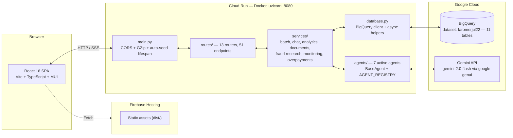
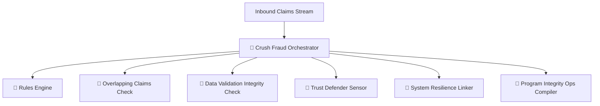
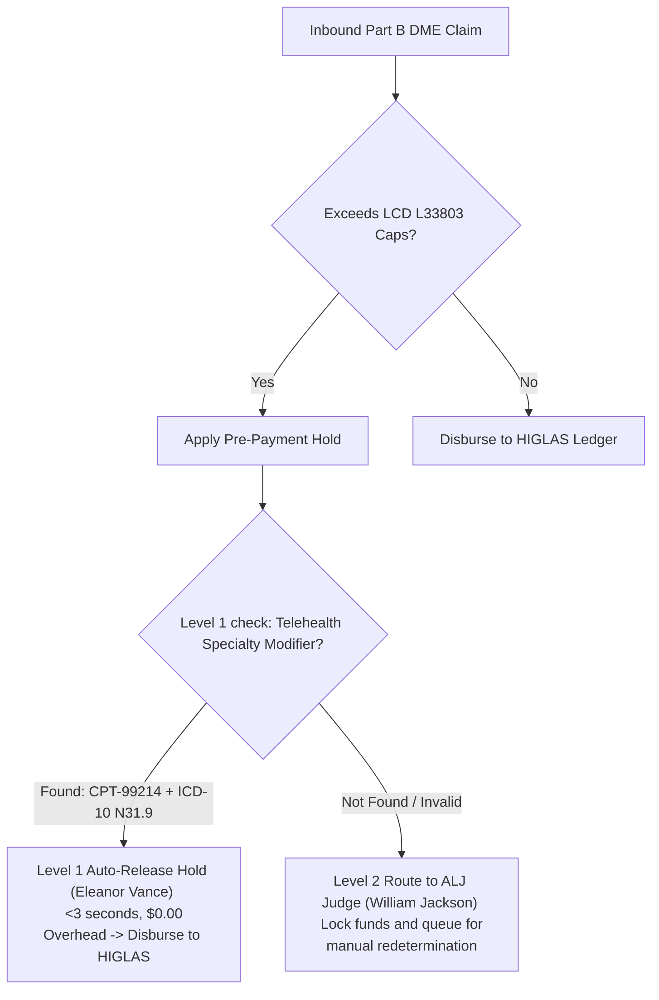

<div align="center">

# 🛡️ CMS Fraud Shield

### AI-Powered CMS payment Integrity Platform

*A Google GPS demo showcasing a federated, multi-agent payment-integrity architecture over Medicare Fee-For-Service (FFS) Part B claims — powered by Gemini, BigQuery, FastAPI, and React.*

<br/>


</div>

---

## 📖 Table of Contents

- [Overview](#-overview)
- [Architecture](#-architecture)
  - [System Architecture](#system-architecture)
  - [The Two-Layer Agent Hierarchy](#the-two-layer-agent-hierarchy)
  - [Two-Tier Pre-Payment Appeals Sandbox](#two-tier-pre-payment-appeals-sandbox)
  - [Data Model (BigQuery)](#data-model-bigquery)
- [Project Structure](#-project-structure)
- [Getting Started](#-getting-started)
- [Configuration](#-configuration)
- [Fraud Agent Catalog](#-fraud-agent-catalog)
- [API Reference](#-api-reference)
- [Deployment](#-deployment)
- [Testing](#-testing)
- [Troubleshooting](#-troubleshooting)

---

## 🎯 Overview

**CMS Fraud Shield** is a high-volume payment integrity demonstration platform built to shift the Centers for Medicare & Medicaid Services (CMS) from slow, reactive "pay-and-chase" retrospective recoveries to **proactive, real-time pre-payment transaction holding**.

The platform ingests structured **CMS-1500 Fee-for-Service (FFS) Part B claims**, integrates **PECOS provider registries**, unmasks shell-company beneficial ownership hierarchies, checks the **HHS OIG Exclusions List (LEIE)**, and screens physical addresses against the **USPS Coding Accuracy Support System (CASS) CMRA directory**—all utilizing a fleet of federated AI agents.

### 🌟 Key Core Capabilities:
- 🤖 **7 Active AI & Rule Agents** — A balanced mixture of 4 Advanced AI Orchestrators (Trust Defender, Crush Fraud, System Resilience, Program Integrity Ops) and 3 Deterministic Rule-Based Checkers executing concurrently over BigQuery and Vertex AI.
- 📡 **Real-Time Stream Processing** — Claims are streamed through batch ingestion engines with progress displayed instantly to the browser using **Server-Sent Events (SSE)**, powering responsive pipeline animations.
- 🧑‍⚖️ **Auditor Workflows & Copilot Chat** — Flagged claims land in an intuitive auditor workspace where human analysts review explainable AI findings, chat with a grounded **Gemini Copilot** about specific claim policies, and document formal audit decisions.
- 📦 **Two-Tier Pre-Payment Appeals Sandbox** — Enforces clinical limits (such as urological catheter quantities under LCD L33803) while offering an instant automated appeal-release mechanism:
  - **Level 1 (Auto-Release):** Telehealth check unmasks active specialty modifiers (CPT-99214 + ICD-10 N31.9) to release genuine patient claims (e.g., *Eleanor Vance*) in under 3 seconds with $0 overhead.
  - **Level 2 (ALJ Redetermination):** Locks and routes complex, unverified claims (e.g., *William Jackson*) to manual judge reviews.
- 💰 **Protected Savings Trackers** — Displays live, looker-powered scoreboards and overpayment recoupment trends, tracking recovered trust funds destined for **HIGLAS disbursements**.

> **⚠️ All data is 100% synthetic.** Every beneficiary MBI, provider NPI, claim number, and document in this system is fabricated demo data seeded from `data/seed/*.json`. Nothing here represents real PII/PHI.

---

## 🏗️ Architecture

CMS Fraud Shield is a highly scalable, Google-Cloud-native web application:

- **Frontend** — React 18 SPA (Vite, TypeScript, Material-UI 6) deployed to **Firebase Hosting**. In development, Vite serves on `:5173` and proxies `/api` → `http://localhost:8000`.
- **Backend** — FastAPI (Python 3.13) packaged as a Docker container and deployed to **Cloud Run** (running on `:8080`).
- **Data Warehouse** — All operational data lives in **Google BigQuery** (dataset `cms-fraud-shield`).
- **AI Tiers** — GenAI workflows utilize the official `google-genai` SDK and **Gemini 2.0 Flash** for sub-second structured JSON responses.

### System Architecture



---

## 🤝 The 7 Active Agents Architecture

CMS Fraud Shield operates a fleet of **7 active agents** representing a balanced mixture of predictive AI orchestrators and deterministic clinical rules. These agents run asynchronously and concurrently to screen and protect Medicare Part B trust funds:

### 🤖 1. Advanced AI-Based Agents (Cognitive Layers)
*   **Threat Simulation "Trust Defender":** Monitors early-stage risk signals, practice address changes, and PECOS ownership transfers to unmask fraudulent provider enrollments.
*   **Pre-Payment Claims Hold "Crush Fraud":** The transactional gatekeeper that intercepts suspect claims and applies immediate prepayment holds (Score ≥ 0.95 with ≥2 corroborating hits).
*   **Enrollment Audit & Unmasking "System Resilience":** Audits the network graph of held claims, revoking fraudulent provider networks or LLC chains linked to excluded operators.
*   **Policy & Referral "Program Integrity Ops":** Compiles standardized investigation packages (dossiers) for DOJ/FBI referral and recommends systemic policy adaptations.

### 📜 2. Deterministic Rule-Based Agents (Clinical & Administrative Checks)
*   **Rules Engine:** Enforces statutory limits (such as quantity caps under LCD L33803) and identifies supplier billing anomalies.
*   **Overlapping Claims Check:** Screens for duplicate procedures, services filed with overlapping dates of service, or multi-provider velocity anomalies.
*   **Data Validation Integrity:** Verifies structured NPI formatting, diagnostic code logic, and fee schedule compliance.



---

## 🛡️ Two-Tier Pre-Payment Appeals Sandbox

Pre-payment holds can cause administrative friction if they catch legitimate patients who exceed standard caps (e.g., severe neurogenic bladder patients requiring more than 30 catheter unit limits). We solve this with our **Two-Tier Pre-Payment Appeals Engine**:



---

## 📁 Project Structure

```
cms-fraud-shield/
├── backend/                        # FastAPI Python 3.13 Backend
│   ├── agents/                     # Multi-Agent registry & base definitions
│   ├── models/                     # BigQuery schema model models
│   ├── routes/                     # 13 routers representing CMS endpoints
│   ├── services/                   # Business logic (appeals, chat, fraud research)
│   ├── main.py                     # App entrypoint & lifespan managers
│   └── requirements.txt            # Python dependencies
├── frontend/                       # React 18 / Vite / TypeScript Frontend
│   ├── src/
│   │   ├── components/
│   │   │   ├── analytics/          # Model drift & ROI Looker components
│   │   │   ├── audit/              # Claim inspector tables
│   │   │   ├── deepdive/           # Grounded Copilot Chat modal
│   │   │   ├── fraud-research/     # DME Loophole Simulator & Appeals Sandbox
│   │   │   └── processing/         # Pipeline animation cards
│   │   └── pages/                  # Auditor, Ingestion, and Referrals Pages
│   └── vite.config.ts
├── data/
│   └── seed/                       # High-fidelity synthetic CMS-1500 claims
└── docs/                           # Executive Presentation & Demo Guides
    ├── architecture_alignment_plan.md
    ├── cms_fraud_shield_slide_deck.md
    └── demo_guide.md
```

---

## 🚀 Getting Started

### Prerequisites
- Python 3.13
- Node.js v20+
- Google Cloud SDK (for active BigQuery connections)

### 1. Run the Backend
```bash
cd backend
python -m venv venv
source venv/bin/activate
pip install -r requirements.txt
python main.py
```
*The server will boot on `http://localhost:8000` and auto-seed BigQuery tables.*

### 2. Run the Frontend
```bash
cd frontend
npm install
npm run dev
```
*The development server will serve on `http://localhost:5173`.*

---

## ⚙️ Configuration

Ensure your environment variables are configured in `backend/.env`:

```env
GOOGLE_CLOUD_PROJECT=faromerjul22
BIGQUERY_DATASET=cms-fraud-shield
GEMINI_API_KEY=your_gemini_api_key_here
```

---

## 📄 References & Demo Handbooks

To assist you during presentations or audits, the following documentation is checked into your git repository under the `docs/` folder:
- 🔬 **[Technical Design Document (TDD)](docs/technical_design_document.md):** Detailed platform architecture, sequence flows, full 29 PRD requirements compliance mapping, and **Section 7: High-Performance Caching & In-Memory Query Engine (1000x Speedup)**.
- 🎬 **[Executive Video Demo Guide](docs/demo_guide.md):** Scripted click-path, recording playbook, and objection handling guide.
