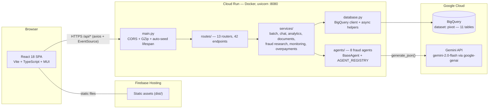
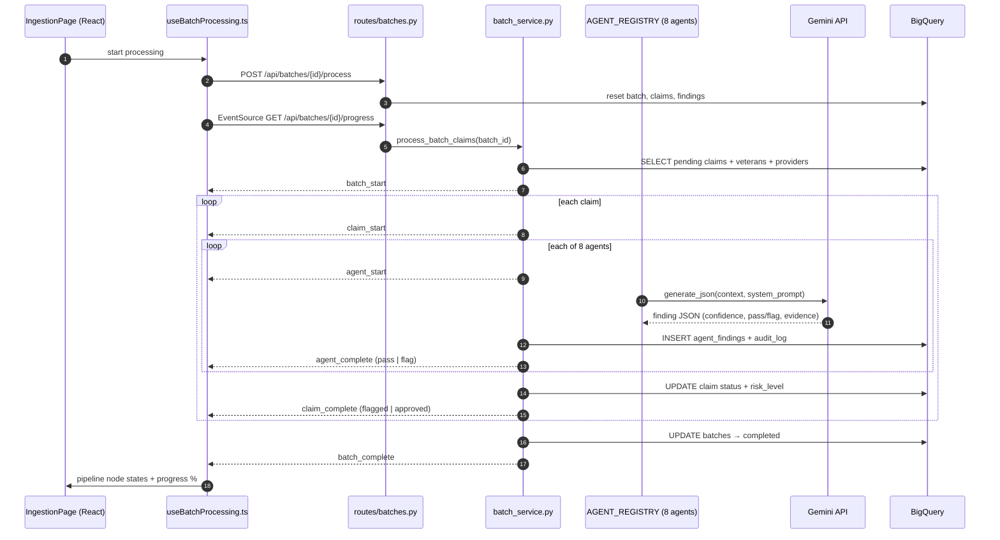
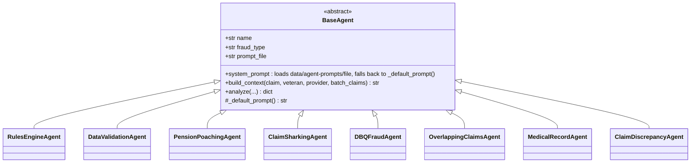

# PIVOT README.md Implementation Plan

> **For agentic workers:** REQUIRED SUB-SKILL: Use superpowers:subagent-driven-development (recommended) or superpowers:executing-plans to implement this plan task-by-task. Steps use checkbox (`- [ ]`) syntax for tracking.

**Goal:** Author a single comprehensive `README.md` at the repo root per the approved spec (`docs/superpowers/specs/2026-07-21-readme-design.md`).

**Architecture:** The README is built section-by-section in spec order, one task per section group, each ending in a commit. All facts below were extracted from the live codebase (schema.py, registry.py, all 13 route files, config.py, main.py, vite.config.ts, package.json, both .env.examples) — copy them verbatim; do not re-derive from memory.

**Tech Stack:** GitHub-flavored Markdown, HTML hero block, shields.io badges, Mermaid (flowchart, sequenceDiagram, erDiagram, classDiagram).

## Global Constraints

- Single file: `README.md` at repo root. No `docs/` split, no image assets.
- The README does NOT get the Google "Free Evaluation Services" source header (it is documentation, not source).
- All GCP identifiers unknown to the repo use angle-bracket placeholders: `<PROJECT_ID>`, `<REGION>`, `<YOUR_FIREBASE_SITE>`.
- Every table/diagram/command must match the verified facts embedded in this plan. Do not invent an acronym expansion for "PIVOT".
- Mermaid must be GitHub-renderable: no experimental syntax.
- Synthetic-data disclaimer appears in Overview AND footer.
- Commit after each task with the session trailer.

---

### Task 1: Hero header, table of contents, overview

**Files:**
- Create: `README.md`

**Interfaces:**
- Produces: `README.md` with hero + TOC; TOC anchors use GitHub slug rules (emoji stripped → leading hyphen, e.g. `## 🚀 Getting Started` → `#-getting-started`). Later tasks MUST use the exact heading texts listed in the TOC below.

- [ ] **Step 1: Write the hero, TOC, and overview**

Write `README.md` with exactly this content:

````markdown
<div align="center">

# 🛡️ PIVOT

### AI-Powered VA Payment Integrity Platform

*A Google GPS demo showcasing multi-agent fraud detection over VA claims — powered by Gemini, BigQuery, FastAPI, and React.*

<br/>


</div>

---

## 📖 Table of Contents

- [Overview](#-overview)
- [Architecture](#-architecture)
  - [System Architecture](#system-architecture)
  - [Batch Processing — SSE Pipeline](#batch-processing--sse-pipeline)
  - [Data Model (BigQuery)](#data-model-bigquery)
  - [Fraud Agent Architecture](#fraud-agent-architecture)
- [Project Structure](#-project-structure)
- [Getting Started](#-getting-started)
- [Configuration](#-configuration)
- [Fraud Agent Catalog](#-fraud-agent-catalog)
- [API Reference](#-api-reference)
- [Deployment](#-deployment)
- [Testing](#-testing)
- [Troubleshooting](#-troubleshooting)
- [Additional Notes](#-additional-notes)

---

## 🎯 Overview

**PIVOT** is a demonstration platform for **VA payment integrity**: it ingests batches of veterans' benefit claims, runs a fleet of **eight Gemini-powered fraud-detection agents** against every claim, and surfaces the results to human auditors through real-time dashboards, streaming batch pipelines, claim-level AI chat, and analytics.

It was built as a Google GPS (Global Public Sector) demo to show how an LLM-based multi-agent system can augment — not replace — human payment-integrity analysts:

- 🤖 **Multi-agent fraud screening** — 8 specialized agents (rules engine, data validation, pension poaching, claim sharking, DBQ fraud, overlapping claims, medical record manipulation, claim discrepancy) each analyze every claim and return a structured finding with a confidence score and a `pass`/`flag` recommendation.
- 📡 **Real-time batch processing** — claims are processed in batches with progress streamed to the browser over **Server-Sent Events**, driving an animated pipeline visualization.
- 🧑‍⚖️ **Auditor workflows** — flagged claims flow to a validation queue where auditors review AI evidence, chat with Gemini about the claim, generate decision notes, and record approve/deny decisions — all audit-logged.
- 💰 **Overpayment recoupment** — identified overpayments are tracked through recoupment with summaries, trends, pivots, and CSV export.
- 📊 **Analytics & monitoring** — fraud trends, agent efficacy, processing speed, cumulative savings, AI-generated chart insights, and system health views.
- 📄 **Document normalization** — EDI (X12) / NCPDP sample parsing and Gemini-based CMS-1500 PDF field extraction.

> **⚠️ All data is synthetic.** Every veteran, provider, claim, and document in this system is fabricated demo data seeded from `data/seed/*.json`. Nothing here is, or ever was, real PII/PHI.

---
````

- [ ] **Step 2: Verify the file renders as expected**

Run: `head -30 README.md && grep -c 'img.shields.io' README.md`
Expected: hero visible; badge count = 13.

- [ ] **Step 3: Commit**

```bash
git add README.md && git commit -m "docs(readme): add hero, TOC, and overview"
```

---

### Task 2: Architecture section (4 Mermaid diagrams + prose)

**Files:**
- Modify: `README.md` (append)

**Interfaces:**
- Consumes: heading text `## 🏗️ Architecture` must match TOC anchor `#-architecture`; subsection headings must match the three TOC sub-anchors.

- [ ] **Step 1: Append the architecture section**

Append exactly:

````markdown
## 🏗️ Architecture

PIVOT is a classic two-tier web app with a Google-Cloud-native backend:

- **Frontend** — React 18 SPA (Vite, TypeScript, MUI 6) deployed to **Firebase Hosting**. In dev, Vite serves on `:5173` and proxies `/api` → `http://localhost:8000`.
- **Backend** — FastAPI (Python 3.13) packaged as a Docker container and deployed to **Cloud Run** (uvicorn on `:8080`, non-root user, container healthcheck).
- **Data** — All state lives in **BigQuery** (dataset `pivot`, 11 tables). There is no local database.
- **AI** — All LLM calls go through `services/gemini_client.py` (the `google-genai` SDK, model `gemini-2.0-flash` by default, JSON-mode responses).

### System Architecture



**Backend layering.** Requests flow `routes/` → `services/` → `agents/` + `database.py`. Routers own their prefixes and tags; `main.py` mounts all 13 with no overrides. Supporting modules: `models/` (domain objects), `schemas/` (Pydantic request/response models), `schema.py` (BigQuery DDL — the `TABLES` dict is the single source of truth for every table).

**BigQuery access pattern.** Project/dataset identifiers cannot be query parameters in BigQuery, so `database.py` regex-validates them (`^[A-Za-z0-9_.:-]+$`) at the trust boundary and interpolates them into SQL; **all values** go through query parameters. Follow this pattern for any new query. Async helpers: `run_query`, `run_query_single`, `run_dml`, `insert_rows` (all wrap the sync client in a thread pool).

**Auto-seed on startup.** The FastAPI lifespan hook calls `reset_and_seed()` on **every boot** — it truncates all tables (reverse-FK order) and reloads `data/seed/*.json`. Demo data therefore resets on every restart; a seed failure is logged as a warning and startup continues.

### Batch Processing — SSE Pipeline

The signature demo flow: a batch of claims is processed by all 8 agents while the browser renders live progress from a Server-Sent-Events stream.



**SSE event vocabulary** (both backend paths emit the same events; `useBatchProcessing.ts` consumes them):

| Event | Payload keys | Meaning |
|---|---|---|
| `batch_start` | `batchId, totalClaims, totalAgents` | Processing began |
| `claim_start` | `claimId, claimNumber, step, totalSteps, message` | A claim entered the pipeline |
| `agent_start` | `claimId, claimNumber, agentName, agentDisplayName, step, totalSteps, message` | An agent began analyzing |
| `agent_complete` | `… + status (flag/pass), recommendation, confidenceScore, message` | Agent finished |
| `claim_complete` | `claimId, claimNumber, status (flagged/approved), riskLevel, flaggedAgents` | Claim adjudicated |
| `batch_complete` | `batchId, totalClaims, flaggedCount, approvedCount` | Batch done |

**Two processing paths — keep them in sync.** `services/batch_service.py` is the real path (every agent, real Gemini calls). `services/fake_batch_service.py::process_batch_claims_fast` is a no-Gemini demo path: identical event shapes, synthetic findings from a seeded RNG (seed = MD5 of the batch id), 20+ claims/sec, and a validation-queue cap (`MAX_VALIDATION_QUEUE = 60` — flagged claims auto-approve once the queue is full). **Any change to event shapes must update both services and the frontend hook.**

Risk classification: max agent confidence ≥ 90 → `high`, ≥ 70 → `medium`, else `low`; any flag ⇒ claim `flagged`, otherwise `approved`.

### Data Model (BigQuery)

Defined in `backend/schema.py` (`TABLES` dict). All primary keys are `STRING` ids; `JSON` columns hold semi-structured payloads.

```mermaid
erDiagram
    batches ||--o{ documents : contains
    batches ||--o{ claims : contains
    veterans ||--o{ claims : files
    providers ||--o{ claims : bills
    documents |o--o{ claims : "source of"
    claims ||--o{ agent_findings : "screened into"
    claims ||--o{ decisions : "adjudicated by"
    claims ||--o{ chat_messages : "discussed in"
    claims ||--o{ overpayments : "may produce"
    claims |o--o{ audit_log : "referenced by"
    claims ||--o{ agent_flags : "flagged in"

    batches {
        string id PK
        string name
        date received_date
        int file_count
        string status
        int total_claims
        int flagged_count
        int approved_count
    }
    veterans {
        string id PK
        string name_display
        string ssn_last4
        date date_of_birth
        date date_of_death
        string vital_status
        string service_branch
        int disability_rating
        json benefits_enrolled
    }
    providers {
        string id PK
        string name
        string npi
        string provider_type
        string specialty
        json address
        int risk_score
        string accreditation_status
        json claim_history
    }
    documents {
        string id PK
        string batch_id FK
        string filename
        string file_type
        string file_path
        int file_size
        string parse_status
    }
    claims {
        string id PK
        string claim_number
        string batch_id FK
        string veteran_id FK
        string provider_id FK
        string claim_type
        string raw_document_id FK
        json normalized_data
        string status
        string risk_level
        numeric billing_amount
        date service_date
        json diagnosis_codes
        json procedure_codes
    }
    agent_findings {
        string id PK
        string claim_id FK
        string agent_name
        string fraud_type
        int confidence_score
        string recommendation
        json flagged_data_points
        string evidence_summary
        json finding_details
        int processing_time_ms
    }
    decisions {
        string id PK
        string claim_id FK
        string decision_type
        string actor
        string actor_role
        string rationale
        numeric savings_amount
    }
    chat_messages {
        string id PK
        string claim_id FK
        string role
        string content
    }
    overpayments {
        string id PK
        string claim_id FK
        string provider_name
        string provider_npi
        numeric original_billing_amount
        numeric allowable_amount
        numeric overpayment_amount
        string recoupment_status
        date date_identified
        date fms_paid_date
        string assigned_analyst
    }
    audit_log {
        string id PK
        timestamp timestamp
        string actor
        string actor_type
        string action_type
        string claim_id FK
        json details
        int confidence_score
    }
    agent_flags {
        string id PK
        string agent_name
        string claim_id FK
        string claim_number
        string flagged_by
        string notes
    }
```



Schema management: `python schema.py` creates the dataset (location `US`) and any missing tables; `python schema.py --drop` drops everything first. Seeding truncates in reverse-FK order, then loads parents-first from 8 seed files (`batches`, `veterans`, `providers`, `claims`, `agent_findings`, `decisions`, `overpayments`, `audit_log` — `documents`, `chat_messages`, and `agent_flags` start empty).

### Fraud Agent Architecture

Every agent is ~30 lines: a `BaseAgent` subclass that sets three attributes and a fallback prompt. All real behavior lives in the base class.



`analyze()` builds a JSON context (`=== CLAIM DATA ===`, `=== VETERAN RECORD ===`, `=== PROVIDER PROFILE ===`, `=== OTHER CLAIMS IN BATCH ===` — peers truncated to 10), calls `gemini_client.generate_json(prompt, system_prompt, temperature=0.3)`, and returns a normalized finding:

```json
{
  "agent_name": "dbq_fraud",
  "fraud_type": "DBQ Fabrication",
  "confidence_score": 87,
  "recommendation": "flag",
  "flagged_data_points": ["..."],
  "evidence_summary": "...",
  "finding_details": {},
  "processing_time_ms": 1240
}
```

`confidence_score` is clamped to 0–100; on any exception the agent fails safe with `confidence_score: 0`, `recommendation: "pass"`, and the error captured in `finding_details.error`. Batch processing iterates `AGENT_REGISTRY` (`agents/registry.py`), so **registering an instance there is all that's needed to add an agent to the pipeline** — see [Fraud Agent Catalog](#-fraud-agent-catalog).

---
````

- [ ] **Step 2: Verify mermaid block integrity**

Run: `grep -c '^```mermaid' README.md`
Expected: `4`. Also run `awk '/^```/{n++} END{print n}' README.md` — expected even number (all fences closed).

- [ ] **Step 3: Commit**

```bash
git add README.md && git commit -m "docs(readme): add architecture section with four mermaid diagrams"
```

---

### Task 3: Project structure, getting started, configuration

**Files:**
- Modify: `README.md` (append)

- [ ] **Step 1: Verify tests directory exists before documenting it**

Run: `ls backend/tests/ | head -5`
Expected: `conftest.py` and `test_*.py` files. If the directory differs, adjust the tree accordingly.

- [ ] **Step 2: Append the sections**

Append exactly:

````markdown
## 📁 Project Structure

```
cms-pivot/
├── backend/                     # FastAPI service (run everything from this directory)
│   ├── main.py                  # App factory: CORS + GZip middleware, auto-seed lifespan, mounts 13 routers
│   ├── config.py                # pydantic-settings — loads backend/.env
│   ├── database.py              # BigQuery client singleton + async query helpers
│   ├── schema.py                # BigQuery DDL: TABLES dict + create/drop CLI
│   ├── seed.py                  # Truncates + reloads all tables from data/seed/*.json
│   ├── agents/                  # 8 Gemini fraud agents — base_agent.py + registry.py
│   ├── models/                  # Domain objects (Veteran, Claim, Provider, …)
│   ├── routes/                  # 13 feature routers → 42 endpoints
│   ├── schemas/                 # Pydantic request/response models
│   ├── services/                # Business logic (batch, fake_batch, chat, analytics, gemini_client, …)
│   ├── repositories/            # Data-access helpers
│   └── tests/                   # pytest suite — BigQuery & Gemini fully mocked
├── frontend/
│   ├── src/
│   │   ├── pages/               # 13 route-level pages (Dashboard, Ingestion, Validation, …)
│   │   ├── components/          # Shared UI
│   │   ├── contexts/            # Auth, GoogleAuth, Agent, AuditorWorkflow, UI, Accessibility, App
│   │   ├── hooks/               # useBatchProcessing.ts — the SSE consumer
│   │   ├── services/            # Axios API wrappers around apiClient.ts
│   │   └── theme/               # MUI theme
│   └── vite.config.ts           # Dev proxy /api → :8000, vendor chunk splitting
├── data/
│   ├── seed/                    # Synthetic demo data (8 JSON files)
│   └── agent-prompts/           # System prompts: one per agent + chat/summary/analytics/fraud-research
├── processing_pipeline/         # Standalone EDI X12 / NCPDP parsing experiments (NOT imported by the server)
└── Dockerfile                   # python:3.13-slim, non-root user, uvicorn :8080, healthcheck
```

---

## 🚀 Getting Started

### Prerequisites

- **Python 3.13**, **Node.js 20+**
- A GCP project with the **BigQuery API** enabled and credentials (service-account JSON or `gcloud auth application-default login`)
- A **Gemini API key** ([Google AI Studio](https://aistudio.google.com/apikey))

### 1 — Backend

All backend commands run from `backend/` — imports are top-level (`from routes…`, `from services…`), so the working directory matters.

```bash
cd backend
python -m venv .venv && source .venv/bin/activate
pip install -r requirements.txt

cp .env.example .env        # then fill in the values (see Configuration)

python schema.py            # one-time: create dataset + tables
python seed.py --reset      # load synthetic demo data

uvicorn main:app --reload --port 8000
```

The API is now at `http://localhost:8000` — interactive docs at `http://localhost:8000/docs`. Note the app **re-seeds BigQuery on every startup**, so `seed.py` is mainly useful for out-of-band resets.

### 2 — Frontend

```bash
cd frontend
npm install
cp .env.example .env        # optional for local dev — Google auth is bypassed on localhost
npm run dev                 # http://localhost:5173, proxies /api → http://localhost:8000
```

On `localhost` the Google-auth gate is bypassed; you land on the role-based login page (auth is demo-grade, driven by React contexts — there is no server-side session).

### 3 — Smoke test

```bash
curl http://localhost:8000/api/health          # API + version
curl http://localhost:8000/api/gemini/health   # verifies your GEMINI_API_KEY
```

Then open the app, go to **Ingestion**, pick a batch, and process it — you should see the SSE-driven pipeline animate.

---

## ⚙️ Configuration

### Backend — `backend/.env` (see `.env.example`)

| Variable | Default | Purpose |
|---|---|---|
| `GEMINI_API_KEY` | — | Google AI Studio key used by `services/gemini_client.py`. Required for real agent runs, chat, summaries. |
| `GEMINI_MODEL` | `gemini-2.0-flash` | Gemini model id for all LLM calls. |
| `BIGQUERY_PROJECT` | — | GCP project holding the dataset. Required. |
| `BIGQUERY_DATASET` | `pivot` | BigQuery dataset name. |
| `GOOGLE_CREDENTIALS_PATH` | *(empty)* | Path to a service-account JSON. Leave empty to use Application Default Credentials (the right choice on Cloud Run). |
| `ALLOWED_ORIGINS` | *(unset)* | Comma-separated extra CORS origins, appended to the built-in localhost origins (read directly by `main.py`). |

### Frontend — `frontend/.env` (see `.env.example`)

| Variable | Purpose |
|---|---|
| `VITE_API_URL` | Backend base URL for `apiClient.ts`. Unset in dev (the Vite proxy handles `/api`); set to the Cloud Run URL for production builds. |
| `VITE_GOOGLE_MAPS_API_KEY` | Google Maps key (map visualizations). |
| `VITE_FIREBASE_API_KEY`, `VITE_FIREBASE_AUTH_DOMAIN`, `VITE_FIREBASE_PROJECT_ID`, `VITE_FIREBASE_STORAGE_BUCKET`, `VITE_FIREBASE_MESSAGING_SENDER_ID`, `VITE_FIREBASE_APP_ID` | Firebase web-app config for the Google-auth gate on deployed builds. |

> ⚠️ `useBatchProcessing.ts` reads `VITE_API_BASE_URL` (not `VITE_API_URL`) for its EventSource URL and falls back to `/api`. If you deploy the frontend somewhere that can't proxy `/api`, set **both** variables.

---
````

- [ ] **Step 3: Commit**

```bash
git add README.md && git commit -m "docs(readme): add project structure, getting started, configuration"
```

---

### Task 4: Fraud agent catalog + API reference

**Files:**
- Modify: `README.md` (append)

- [ ] **Step 1: Append the sections**

Append exactly:

````markdown
## 🕵️ Fraud Agent Catalog

Eight agents run against every claim, in registry order. Each is a thin `BaseAgent` subclass; its system prompt lives in `data/agent-prompts/<prompt_file>` (with an in-code fallback).

| # | Agent (display name) | `name` | Fraud type | What it detects |
|---|---|---|---|---|
| 1 | **Gemini AI Rules Engine** | `rules_engine` | VA Financial Policy Violation | Service-date validity (incl. billing after date of death), provider NPI/accreditation eligibility, ICD-10/CPT benefit compliance, billing reasonableness (> $10,000 single services). |
| 2 | **Data Validation Agent** | `data_validation` | Data Integrity Violation | Cross-references claim vs. veteran MVI/DMF and NPI registry: deceased-veteran billing, SSN last-4 mismatches, invalid NPIs, service-branch inconsistencies. |
| 3 | **Pension Poaching Agent** | `pension_poaching` | Pension Poaching | Predatory benefit practices: asset manipulation to qualify for needs-based benefits, unaccredited reps, excessive fees, targeting of elderly veterans. |
| 4 | **Claim Sharking Agent** | `claim_sharking` | Claim Sharking | Embedded consulting fees, amounts inflated vs. VA fee schedules, unauthorized representatives, suspicious filing patterns. |
| 5 | **DBQ Fraud Agent** | `dbq_fraud` | DBQ Fabrication | Disability Benefits Questionnaire fabrication: template copy-paste, ratings inconsistent with diagnoses, examiner high-rating patterns. |
| 6 | **Overlapping Claims Agent** | `overlapping_claims` | Duplicate/Overlapping Billing | Duplicate procedure codes, service-date overlaps, double-billing across payers, bundling violations (uses batch peer context). |
| 7 | **Medical Record Agent** | `medical_record` | Medical Record Manipulation | Document-integrity/alteration signs, metadata anomalies, clinical implausibility, signature irregularities. |
| 8 | **Claim Discrepancy Agent** | `claim_discrepancy` | Claim Data Discrepancy | Internal consistency: ICD-10/CPT compatibility, service-date logic, billing vs. expected ranges, demographic mismatches. |

### Adding an agent

1. Create `backend/agents/my_agent.py` subclassing `BaseAgent` — set `name`, `fraud_type`, `prompt_file`, and a `_default_prompt()` fallback.
2. Add the system prompt at `data/agent-prompts/<prompt_file>`.
3. Register an instance in `AGENT_REGISTRY` and add a display name to `AGENT_DISPLAY_NAMES` in `backend/agents/registry.py`.

Batch processing iterates the registry, so that's it — no other wiring.

---

## 🔌 API Reference

42 endpoints across 13 routers. Full interactive documentation: **`http://localhost:8000/docs`** (Swagger) / **`/redoc`**.

<details>
<summary><b>Health & System — <code>/api</code></b></summary>

| Method | Path | Description |
|---|---|---|
| GET | `/api/health` | API health/version check |
| GET | `/api/gemini/health` | Gemini client health check |
| POST | `/api/reset` | Reset and reseed the database |

</details>

<details>
<summary><b>Batches — <code>/api/batches</code></b></summary>

| Method | Path | Description |
|---|---|---|
| GET | `/api/batches` | List batches (by received_date, limit/offset) |
| GET | `/api/batches/{batch_id}` | Get one batch |
| GET | `/api/batches/{batch_id}/documents` | List a batch's documents |
| POST | `/api/batches/{batch_id}/process` | Reset batch state and start processing |
| GET | `/api/batches/{batch_id}/progress` | 📡 **SSE** — live processing events (`text/event-stream`) |
| GET | `/api/batches/{batch_id}/tables/{table_name}` | Rows from an allowed table, scoped to the batch |

</details>

<details>
<summary><b>Claims & Chat — <code>/api/claims</code></b></summary>

| Method | Path | Description |
|---|---|---|
| GET | `/api/claims` | List claims (veteran/provider joins; filters: status, risk_level, batch_id, provider_id) |
| GET | `/api/claims/agent-flags` | All agent flags (Agent Management page) |
| DELETE | `/api/claims/agent-flags/{flag_id}` | Delete an agent flag |
| GET | `/api/claims/{claim_id}` | Claim detail with findings + latest decision |
| GET | `/api/claims/{claim_id}/findings` | Agent findings for a claim |
| GET | `/api/claims/{claim_id}/summary` | AI executive summary of a claim |
| POST | `/api/claims/{claim_id}/generate-notes` | AI-drafted decision notes |
| POST | `/api/claims/{claim_id}/decide` | Record approve/deny, update status, audit-log |
| POST | `/api/claims/{claim_id}/chat` | Chat with Gemini about a claim |
| GET | `/api/claims/{claim_id}/chat/history` | Chat history for a claim |

</details>

<details>
<summary><b>Analytics — <code>/api/analytics</code></b></summary>

| Method | Path | Description |
|---|---|---|
| GET | `/api/analytics/fraud-trends` | Fraud trend series |
| GET | `/api/analytics/agent-efficacy` | Per-agent efficacy metrics |
| GET | `/api/analytics/processing-speed` | Throughput / surge-capacity figures |
| GET | `/api/analytics/savings` | Cumulative savings + total |
| GET | `/api/analytics/insights` | AI insight for a chart (`chart_type` param) |
| GET | `/api/analytics/dashboard-metrics` | Aggregated dashboard metrics |

</details>

<details>
<summary><b>Overpayments — <code>/api/overpayments</code></b></summary>

| Method | Path | Description |
|---|---|---|
| GET | `/api/overpayments` | List (status filter, pagination, sorting) |
| GET | `/api/overpayments/summary` | Summary metrics |
| GET | `/api/overpayments/trend` | Recoupment trend |
| GET | `/api/overpayments/pivot` | Pivot by field (default `provider`) |
| GET | `/api/overpayments/export` | CSV export |
| GET | `/api/overpayments/{overpayment_id}` | Overpayment detail |

</details>

<details>
<summary><b>Documents — <code>/api/documents</code></b></summary>

| Method | Path | Description |
|---|---|---|
| GET | `/api/documents/{doc_id}/raw` | Raw document file (FileResponse) |
| POST | `/api/documents/{doc_id}/parse` | Parse a document |
| GET | `/api/documents/{doc_id}/parsed` | Parse status + normalized claim data |

</details>

<details>
<summary><b>Audit Log — <code>/api/audit-log</code></b></summary>

| Method | Path | Description |
|---|---|---|
| POST | `/api/audit-log/event` | Create one audit entry |
| POST | `/api/audit-log/batch` | Create many audit entries |
| GET | `/api/audit-log` | List/filter (actor, action_type, claim_id) |
| GET | `/api/audit-log/{entry_id}` | Get one entry |

</details>

<details>
<summary><b>Audit Workflows — <code>/api/audit-workflows</code></b></summary>

| Method | Path | Description |
|---|---|---|
| POST | `/api/audit-workflows/execute-step` | Run one AI workflow step |
| POST | `/api/audit-workflows/summarize` | AI executive summary of audit data |
| POST | `/api/audit-workflows/compliance-check` | AI compliance check |
| POST | `/api/audit-workflows/risk-score` | AI risk scoring |

</details>

<details>
<summary><b>Fraud Research — <code>/api/fraud-research</code></b></summary>

| Method | Path | Description |
|---|---|---|
| GET | `/api/fraud-research/clusters` | Anomaly clusters |
| GET | `/api/fraud-research/analyze` | Analyze the anomaly landscape |
| POST | `/api/fraud-research/search` | Search fraud patterns |

</details>

<details>
<summary><b>Alerts, Monitoring & Normalization</b></summary>

| Method | Path | Description |
|---|---|---|
| GET | `/api/alerts/recent` | Recent flagged claims with flagging agents |
| GET | `/api/monitoring/health-metrics` | System health metrics |
| GET | `/api/monitoring/logs` | Log entries by category |
| GET | `/api/normalization/samples` | EDI/NCPDP sample test cases (raw + parsed) |
| POST | `/api/normalization/parse-cms1500` | Gemini extraction from the CMS-1500 sample PDF |
| GET | `/api/normalization/cms1500-pdf` | Serve the CMS-1500 sample PDF |

</details>

---
````

- [ ] **Step 2: Verify endpoint count**

Run: `grep -cE '^\| (GET|POST|DELETE|PUT|PATCH) \|' README.md`
Expected: `42`.

- [ ] **Step 3: Commit**

```bash
git add README.md && git commit -m "docs(readme): add fraud agent catalog and API reference"
```

---

### Task 5: Deployment section

**Files:**
- Modify: `README.md` (append)

- [ ] **Step 1: Confirm apiClient base-URL behavior**

Run: `grep -n "VITE_API_URL\|baseURL" frontend/src/services/apiClient.ts`
Adjust the `VITE_API_URL` example below if the client appends `/api` itself (i.e., whether the value should include the `/api` suffix).

- [ ] **Step 2: Append the section**

Append exactly (fixing the `VITE_API_URL` example per Step 1 if needed):

````markdown
## ☁️ Deployment

The intended topology: **backend container on Cloud Run, frontend on Firebase Hosting.**

### Docker (local or any container host)

Build from the **repo root** — the image copies `backend/` and `data/`:

```bash
docker build -t pivot-backend .
docker run --rm -p 8080:8080 \
  --env-file backend/.env \
  -v "$PWD/sa-key.json:/secrets/sa.json:ro" \
  -e GOOGLE_CREDENTIALS_PATH=/secrets/sa.json \
  pivot-backend
```

The image runs uvicorn on **:8080** as a non-root user (`appuser`, UID 10001) with a built-in healthcheck against `/api/health`.

### Backend → Cloud Run

```bash
# 1. Build + push
gcloud builds submit --tag gcr.io/<PROJECT_ID>/pivot-backend .

# 2. Store the Gemini key in Secret Manager
gcloud secrets create pivot-gemini-key --data-file=- <<< "<YOUR_GEMINI_API_KEY>"

# 3. Deploy
gcloud run deploy pivot-backend \
  --image gcr.io/<PROJECT_ID>/pivot-backend \
  --region <REGION> \
  --port 8080 \
  --set-env-vars "BIGQUERY_PROJECT=<PROJECT_ID>,BIGQUERY_DATASET=pivot,GEMINI_MODEL=gemini-2.0-flash,ALLOWED_ORIGINS=https://<YOUR_FIREBASE_SITE>.web.app" \
  --set-secrets "GEMINI_API_KEY=pivot-gemini-key:latest" \
  --allow-unauthenticated
```

Notes:
- Leave `GOOGLE_CREDENTIALS_PATH` unset on Cloud Run — the service's runtime service account is used via ADC. Grant it **BigQuery Data Editor** and **BigQuery Job User**.
- `ALLOWED_ORIGINS` must include your Firebase Hosting origin or the browser will hit CORS errors.
- Remember: the service **re-seeds demo data on every cold start** — a feature for demos, a surprise otherwise.

### Frontend → Firebase Hosting

```bash
cd frontend

# Point the SPA at the Cloud Run service (plus Firebase/Maps keys as needed)
cat > .env.production <<'EOF'
VITE_API_URL=https://pivot-backend-<HASH>-<REGION>.a.run.app
EOF

npm run build          # tsc -b && vite build — type errors fail the build

firebase init hosting  # first time only: public dir = dist, SPA rewrites = yes
firebase deploy --only hosting
```

---
````

- [ ] **Step 3: Commit**

```bash
git add README.md && git commit -m "docs(readme): add deployment section"
```

---

### Task 6: Testing, troubleshooting, footer

**Files:**
- Modify: `README.md` (append)

- [ ] **Step 1: Append the sections**

Append exactly:

````markdown
## 🧪 Testing

Backend tests mock **both** BigQuery and Gemini (see `backend/tests/conftest.py`) — no GCP credentials or network needed:

```bash
cd backend
python -m pytest tests/                                                          # everything
python -m pytest tests/test_services.py::TestBatchService::test_sse_event_sequence  # one test
```

The frontend has no test or lint setup; the type check **is** the gate:

```bash
cd frontend
npm run build     # tsc -b && vite build — fails on any type error
```

---

## 🔧 Troubleshooting

| Symptom | Cause / Fix |
|---|---|
| `Auto-seed skipped or failed` warning at startup | BigQuery credentials/project not configured. The app still boots; fix `.env` and restart. |
| Demo data keeps resetting | By design — the lifespan hook re-seeds on **every** startup. |
| `/api/gemini/health` fails; agents all return errors | `GEMINI_API_KEY` missing or invalid. |
| Frontend gets 404/ECONNREFUSED on `/api/*` in dev | The Vite proxy targets `http://localhost:8000` — run uvicorn on **8000** locally (Docker uses **8080**). |
| CORS errors from a deployed frontend | Add the frontend origin to `ALLOWED_ORIGINS` on the backend service. |
| BigQuery 403 / permission denied | The identity needs **BigQuery Data Editor** + **BigQuery Job User** on the project. |
| Batch progress stream never emits | Ensure you `POST …/process` first, then open the `…/progress` EventSource; check `VITE_API_BASE_URL` if the frontend is hosted without an `/api` proxy. |
| `import` errors running backend scripts | Run from `backend/` — imports are top-level (`from routes…`). |

---

## 📎 Additional Notes

- **`processing_pipeline/`** contains standalone EDI (X12) / NCPDP parsing scripts and experiments. It is **not imported by the server** — the normalization routes use their own service code.
- **Conventions:** every source file starts with the Google "Free Evaluation Services" copyright header — keep it on new files. Follow the BigQuery identifier-validation + query-parameter pattern in `database.py` for any new query. Keep both batch paths and `useBatchProcessing.ts` in sync when touching SSE event shapes.
- **Data:** 100% synthetic, seeded from `data/seed/*.json`. No real veteran, provider, or claim data exists anywhere in this repository.

<div align="center">
<sub>Built as a Google GPS demo · FastAPI · Gemini · BigQuery · React</sub>
</div>
````

- [ ] **Step 2: Commit**

```bash
git add README.md && git commit -m "docs(readme): add testing, troubleshooting, and footer"
```

---

### Task 7: Final verification pass

**Files:**
- Modify: `README.md` (fixes only, if needed)

- [ ] **Step 1: Structural checks**

```bash
awk '/^```/{n++} END{print "fences:", n}' README.md          # even number
grep -c '^```mermaid' README.md                               # 4
grep -n '^## ' README.md                                      # matches TOC order exactly
grep -cE '^\| (GET|POST|DELETE|PUT|PATCH) \|' README.md       # 42
```

- [ ] **Step 2: TOC anchor check**

For each TOC link, confirm a matching heading exists (GitHub slug = lowercase, emoji stripped, spaces → `-`, leading hyphen retained for emoji-prefixed headings).

- [ ] **Step 3: Render preview for the user**

Send `README.md` to the user with SendUserFile (display: render) so the Mermaid diagrams and tables can be visually confirmed.

- [ ] **Step 4: Final commit (if fixes were made)**

```bash
git add README.md && git commit -m "docs(readme): final verification fixes"
```
