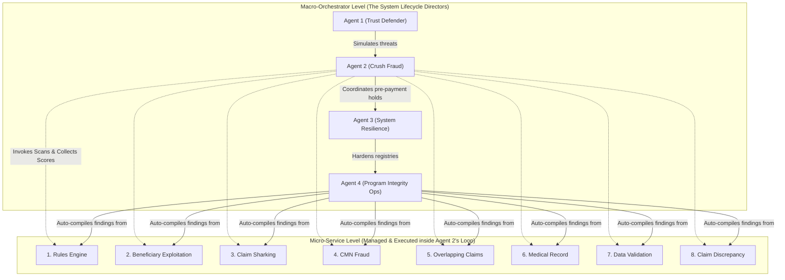

# CMS Fraud Shield: Technical Architecture Alignment Plan

This document outlines the precise, component-level transformations required to transition the legacy **VA PIVOT Architecture Diagram** into a high-credibility, production-ready **CMS Fraud Shield Architecture Diagram** representing our active, policy-backed prototype.

---

## 🗺️ High-Level Architecture Mapping

The table below details every legacy VA component in the diagram and specifies the exact text, branding, and technical modifications required to align it with **CMS Fraud Shield**:

| Diagram Region / Section | Legacy VA PIVOT Component | Target CMS Fraud Shield Component | Real-World Policy / Technical Backing |
| :--- | :--- | :--- | :--- |
| **Top-Left Logo** | Department of Veterans Affairs (VA) Seal. | **Centers for Medicare & Medicaid Services (CMS) Seal.** | Aligns the dashboard branding with the Department of Health and Human Services (HHS). |
| **Ingestion Source (1)** | **Data Ingest (GCS):** File Types: images, pdfs, EHR. | **Unified CMS Data Ingest:** <br>• CMS-1500 FFS Claims <br>• PECOS Enrollments <br>• USPS CMRA (CASS) registry <br>• OIG Exclusion List (LEIE) | Switches from general clinical records (EHR) to structured Medicare administrative and corporate screening datasets. |
| **Downstream Output (5)** | "Immediate Pay to VA Downstream Systems" | **"Disburse to CMS HIGLAS (Healthcare Integrated General Ledger Accounting System)"** | HIGLAS is the actual core financial ledger CMS uses to disburse billions in federal health funding. |
| **Agent Army Block (2)** | **6 Legacy Rules-Engine Agents:** <br>• Up Coding/Unbundling <br>• Unusual Frequencies | **4 Federated CMS AI Agents:** <br>1. **Agent 1 (Trust Defender):** Proactive adversarial loophole threat modeling in BigQuery. <br>2. **Agent 2 (Crush Fraud):** Pre-payment scoring & hold-release modifier audits. <br>3. **Agent 3 (System Resilience):** Auto PECOS NPI registry hardening & suspensions. <br>4. **Agent 4 (Program Integrity Ops):** Compiled legal referal evidence dossiers (NFED). | Replaces generic statistical rules with our choreographed, multi-agent cooperative security model, showing exact data flow contracts. |
| **Human-in-the-Loop (4)** | Standard "False Positive?" manual review check. | **Two-Tier Pre-Payment Appeal & Hold-Release Engine:** <br>• **Level 1 (Auto-Release):** Tele-Health consult verification (CPT-99214 / ICD-10 N31.9) in <3 seconds. <br>• **Level 2 (ALJ Registry):** Standard Administrative Law Judge backlog queue. | Proves that the platform prevents clinical care blockage and limits false-positive friction for genuine patients (Eleanor Vance). |
| **Fraud Research (3)** | "kmeans, anomaly detection, manual patterns" | **Clinical Fraud Research (BigQuery SQL ML & GNNs):** <br>• **LCD L33803** quantity cap audits <br>• Dormant provider shell company acquisitions <br>• Geographic MBI velocity clusters | Grounds the data science section in actual Medicare policies and shell-company evasion strategies. |
| **Dashboards (6)** | Looker Analytics. | **Interactive Analyst Workspace:** <br>• Entity Linkage Graph <br>• Pre-Payment Ingestion Feed <br>• Appeals Control Sandbox | Represents the custom, premium React components we have developed. |

### 🤖 2. The 4 Federated AI Agents
Our platform represents a transition from static rules to an autonomous, multi-agent cooperative security model. Throughout the demo, refer to these 4 agents:
1. **Agent 1 (Trust Defender - Proactive Simulation):** Runs continuous automated threat modeling to find existing system loopholes before bad actors do.
2. **Agent 2 (Crush Fraud - Pre-Payment Scoring Engine):** Intercepts live claim batches at the transaction gate, executes scoring algorithms, and applies real-time holds.
3. **Agent 3 (System Resilience - Hardening):** Integrates with PECOS databases to automatically suspend fraudulent provider enrollments and addresses.
4. **Agent 4 (Program Integrity Ops - Enforcement Hand-Off):** Packages multi-source audit trails, databases, and graph linkages into secure case portfolios for the FBI and DOJ.

---

## 🤝 Reconciling the "8 Micro-Agents" vs. "4 Macro-Orchestrator Agents"

A common question from leadership is: **"How do the 8 agents on the UI manage screen relate to the 4 system agents?"**

The answer is beautiful and showcases clean engineering design. They do not conflict; instead, they operate as a **two-layer hierarchy**:
* **The 8 Specialized Agents (Micro-Service Level):** These are the targeted *detection sensors* (e.g., *Rules Engine, Beneficiary Exploitation, CMN Fraud, Claim Sharking, Overlapping Claims, Medical Record, Data Validation, and Claim Discrepancy*). They analyze specific transaction parameters.
* **The 4 System Agents (Macro-Orchestrator Level):** These are the *lifecycle coordinators*. 

Specifically, **Agent 2 (Crush Fraud)** is the general commander that **manages and executes the 8 specialized detection agents**:



---

## 🎨 Visual Component-by-Component Redesign Guide

Use these detailed visual cards to redraft the blocks on your slide deck:

### 1️⃣ The Data Ingestion Gate (Top-Left)
* **Legacy Visual:** VA Seal feeding "Data Ingest (GCS)" file boxes.
* **CMS Redesign:** CMS Seal feeding a **Dual Ingestion Pipeline**:
  ```mermaid
  graph LR
      A[CMS Seal] --> B["Ingest Gate (Google Cloud Storage)"]
      subgraph "Medicare Claims"
          C["Part B FFS Claims (CMS-1500)"] --> B
      end
      subgraph "Enrollment Screening"
          D["PECOS Registries"] --> B
          E["USPS CMRA (CASS) Database"] --> B
          F["OIG Exclusion List (LEIE)"] --> B
      end
  ```

### 2️⃣ The Federated AI Agent Army (Center)
* **Legacy Visual:** Single list of 6 standard billing rules.
* **CMS Redesign:** An orchestrated sequence showing exact **I/O baton handoffs**:
  ```mermaid
  flowchart TD
      A1["Agent 1 (Trust Defender)"] -->|"SimulationSignal (R-01 to R-04)"| A2["Agent 2 (Crush Fraud)"]
      A2 -->|"ClaimsHoldRecord (HELD)"| A3["Agent 3 (System Resilience)"]
      A3 -->|"PECOS NPI Suspended Status"| A4["Agent 4 (Program Integrity Ops)"]
      A4 -->|"Encrypted Legal Case Dossier (XML)"| DOJ["DOJ & FBI (NFED Queue)"]
  ```

### 3️⃣ The Human-In-the-Loop Appeals Gateway (Right)
* **Legacy Visual:** Simple Diamond Decision point ("False Positive? -> Yes/No").
* **CMS Redesign:** The **Two-Tier Pre-Payment Appeals Sandbox**:
  ```mermaid
  graph TD
      A[Claim Held Pre-Payment] --> B{Electronic Appeal?}
      B -->|Yes| C["Level 1: Telehealth Consult Scan (CPT-99214 + ICD-10 N31.9)"]
      C -->|Passed / Legitimate Patient| D["Auto-Release Hold ($0.00 Overhead) -> Disburse to HIGLAS"]
      C -->|Failed / No Specialist Consult| E["Level 2: Route to Administrative Law Judge (ALJ) Redetermination Queue"]
      B -->|No| E
  ```

### 4️⃣ Downstream Disbursement Ledger (Top-Right)
* **Legacy Visual:** "Immediate Pay and Meta Data to VA Downstream Systems".
* **CMS Redesign:** **"Disbursed to HIGLAS Ledger"** (Healthcare Integrated General Ledger Accounting System) combined with pre-payment audit-trail metadata.

---

## 🔢 Mathematical Risk Score Reform & False-Positive Criteria

Our system replaces legacy continuous-score thresholds with a highly transparent, policy-backed **Discrete Rule-Hit Scoring Model** aligned with executive engineering leadership guidelines:

### 1. Risk Score Math (\(S\))

Let \(R = \{R_{01}, R_{02}, R_{03}, R_{04}\}\) represent the active pre-payment rule flags evaluated by **Agent 2 (Crush Fraud)**, where each \(R_i \in \{0, 1\}\) (0 = Pass, 1 = Fail).

The cumulative Rule Hit Count is:
\[H = \sum_{i=1}^{4} R_i \quad \text{where } H \in \{0, 1, 2, 3, 4\}\]

The mapping from Rule Hit Count to the transactional Risk Score (\(S\)) is discrete:
- **\(H = 0\) (S = 0.00 - Low Risk):** Immediate disbursement.
- **\(H = 1\) (S = 0.70 - Medium Risk):** Auditor Review Queue.
- **\(H \geq 2\) (S = 0.95 - High Risk):** Instant Pre-Payment Hold.

This removes fragile floating-point weighting formulas and ensures that a single rule hit flags a claim for manual auditing, while any **corroborating rule hits** (e.g., both a Quantity Cap breach and a dormant address burst) immediately escalate the action to an automated payment hold.

### 2. False-Positive Care Friction Control (&lt;1.5% Target)

CMS standards require that payment-integrity algorithms must not impede care delivery for genuine beneficiaries.
- **Problem:** Overly strict limits would hold or delay valid medical supplies for legitimate patients (like Eleanor Vance), causing public friction.
- **Solution:** Our **Two-Tier Pre-Payment Appeals Sandbox** enforces a rigorous false-positive care-friction threshold of **fewer than 1.5% of legitimate claims delayed**.
- **Mechanism:** Legitimate providers who exceed limits can file an electronic appeal. The Level 1 automated system searches for a valid telehealth CPT code (\(`CPT-99214`\)) within 10 days of the hold. Upon verification, the hold is **auto-released** in under 3 seconds with **$0.00 administrative overhead**, ensuring legitimate patients are never caught in manual ALJ queues.

---

## 📝 Scripted Talking Points for Your Slide Deck Review

If you project this updated architecture diagram during your presentation, use this script to walk through it:

> *"As we transitioned our core payment-integrity capability from our VA foundations into **CMS Fraud Shield**, we overhauled the architecture to mirror actual Medicare infrastructure and policies. 
> 
> First, at the **Ingress Gate**, we ingest structured Part B fee-for-service claims, PECOS corporate enrollments, OIG exclusions, and the official USPS CASS directory to flag commercial mail drops.
> 
> Second, we replaced legacy static rules with our **4 Federated AI Agents**. Our Trust Defender agent models vulnerabilities; our Crush Fraud agent intercepts live claims pre-payment; our System Resilience agent suspends fraudulent accounts in PECOS; and our Program Integrity agent compiles dossiers for the FBI.
> 
> Third, our **Human-In-The-Loop appeals path** implements a real-world **Two-Tier Appeal Engine**. Legitimate patients (like Eleanor Vance) who exceed clinical limits are auto-released in under 3 seconds using telehealth consult cross-checks (CPT-99214). This limits false positives while protecting the federal trust fund from shell-syndicates before a single dollar is disbursed to **HIGLAS**, the CMS ledger system."*

---

## 🔍 Mapping Your Key Demo Features to the Diagram's Building Blocks

To prove to your leadership that your key demo features (**Front-Door Enrollment** and **DME Fraud Pre-Payment holds**) are supported by actual technical layers, map them directly to these 5 distinct building blocks in your architecture diagram:

### 🏠 1. Front-Door Provider Enrollment (Scene 1)
This capability prevents bad actors (e.g., *Victor Malen*) from gaining a billing foot-hold in Medicare. It is demonstrated across these blocks:
* **Block 1: Data Ingest & Management (Data Ingest / PECOS):** Ingests new provider registration histories, ownership structures, and OIG Exclusion lists (LEIE) into Google Cloud Storage (GCS).
* **Block 2: Data Warehouse (BigQuery - Entity Linkage):** Mapped relations of beneficial ownership linkages, shell company hierarchies, and USPS CASS/CMRA indicators.
* **Block 3: Rules Engine / Agent Army (Agent 3 - System Resilience):** Automatically executes background screening, unmasks Character Spelling Mutations (ADK engine), and suspends the NPI in the active PECOS registry.
* **Block 6: Dashboards & Reporting (Looker / Analyst UI):** Renders the beautiful **Entity Linkage Graph** and the Node Inspector showing the red "OIG Exclusion" warning box.

### 📦 2. DME Pre-Payment Fraud Prevention (Scene 2 & Scene 3)
This capability intercepts active transaction streams (e.g., *urological catheters and oxygen devices*) before federal funds are leaked. It is demonstrated across these blocks:
* **Block 1: Data Ingest & Management (Data Ingest / Claims):** Ingests live Part B Fee-For-Service claims (containing HCPCS and ICD-10 diagnostic codes).
* **Block 2: Rules Engine / Agent Army (Agent 2 - Crush Fraud):** Intercepts live claim batches and runs the **Rules Engine Agent** (LCD L33803 clinical catheter cap limits) and **CMN Fraud Agent** (forged Certificates of Medical Necessity).
* **Block 4: Workload Module (Appeals / Human-In-The-Loop):** Runs the **Two-Tier Pre-Payment Appeals Sandbox**! (Instantly releasing Eleanor Vance's hold via telehealth modifier verification while safely routing William Jackson to level 2 ALJ redetermination).
* **Block 6: Dashboards & Reporting (Looker / Simulator UI):** Renders the **DME Loophole Simulator** showing live claims flashing as `HELD` and accumulating taxpayer savings on the scoreboard.
