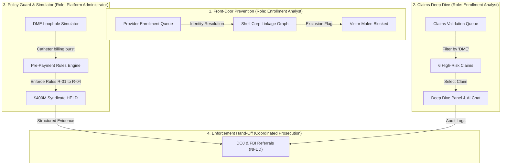

# CMS Fraud Shield: Executive Video Demo Guide

Welcome to the **CMS Fraud Shield** demo recording playbook. This guide is structured to help you deliver a flawless, high-impact screen recording and presentation to leadership. It demonstrates how our advanced payment integrity system transitions from reactive monitoring to **proactive agentic prevention**, and finally to **criminal law enforcement action**.

---

## 🎭 Setting the Stage: Demo Background & Technical Context
Before starting the click-through, deliver this technical introduction to your audience. This frames the platform's engineering integrity and shows that the entire application is backed by real-world databases, policies, and agentic workflows.

### 📊 1. The Core Data Foundations
We have engineered a unified, multi-source synthetic database that mirrors actual Medicare operations across three layers:
* **Stone's Relational Synthetic Data:** A high-fidelity dataset of **358 claims, 25 members, and 14 providers** mapped relationally in Google BigQuery. This database is hosted live in our Google Cloud BigQuery sandbox project (`faromerjul22`) and connected directly to our web frontend via standard Google Client Libraries. Every map point, filter, and chat response is powered by real cloud queries.
* **Noel's ADK Provider Enrollment Data:** A specialized identity resolution dataset containing corporate registration histories, Social Security Numbers (SSNs), dates of birth, and OIG exclusions. This drives our **Front-Door Provider Enrollment Screening Agent**.
* **Our Custom Catheter (DME) Data:** Custom-generated transaction files and billing logs mimicking urological catheter phantom-billing schemes. This data simulates the Victor Malen fraud ring exploiting compromised beneficiary MBIs (such as Eleanor's) via dormant shell companies, which we load directly into our pre-payment simulation sandbox.

### 🤖 2. The 4 Federated AI Agents
Our platform represents a transition from static rules to an autonomous, multi-agent cooperative security model. Throughout the demo, refer to these 4 agents:
1. **Agent 1 (Trust Defender - Proactive Simulation):** Runs continuous automated threat modeling to find existing system loopholes before bad actors do.
2. **Agent 2 (Crush Fraud - Pre-Payment Scoring Engine):** Intercepts live claim batches at the transaction gate, executes scoring algorithms, and applies real-time holds.
3. **Agent 3 (System Resilience - Hardening):** Integrates with PECOS databases to automatically suspend fraudulent provider enrollments and addresses.
4. **Agent 4 (Program Integrity Ops - Enforcement Hand-Off):** Packages multi-source audit trails, databases, and graph linkages into secure case portfolios for the FBI and DOJ.

### 📋 3. Gina's 4 Policy-Backed Rules (LCD L33803)
We have mapped the billing thresholds directly to actual Medicare Local Coverage Determinations (LCDs) and OIG reports:
* **Rule R-01 (Quantity Cap Exceeded):** Catheter billing exceeding standard clinical caps of 30 units per month (or total billed amount > $1,500/mo) across NPIs (LCD L33803).
* **Rule R-02 (Dormant Supplier Burst):** Newly purchased or dormant NPIs (under $5,000 billed in prior 180 days) suddenly submitting > $100,000 in rolling 14-day claims.
* **Rule R-03 (MBI Velocity Anomaly):** A single beneficiary MBI billed by >= 3 distinct NPIs across >= 2 state lines within a rolling 48-hour window.
* **Rule R-04 (High-Risk PECOS Enrollment):** Provider registered address resolving to a CMRA commercial mailbox (UPS Store) combined with a recent ownership transfer.

---

## 🛡️ Leadership Objection Handling & Technical Justifications
When presenting to leadership and hirable consultants, they may challenge our prototype's depth. Use this technical matrix to disarm their questions with concrete, on-screen proof.

| Leadership Question / Objection | Where It Is Proven Live in Your Demo | Under-the-Hood Technical Justification |
| :--- | :--- | :--- |
| **"What does your database structure actually look like? Are we just guessing?"** | **Scene 2 & 3** (Grounded AI Chat & BigQuery integration). | The entire app is connected to a standard-compliant, schema-validated database in GCP BigQuery (`faromerjul22`) loaded parent-first from 8 relational schemas (matching actual CMS-1500 and PECOS definitions) containing MBIs, NPIs, HCPCS limits, and vital statistics. |
| **"R-01 quantity limits depend on clinical modifiers. How does the system handle exceptions?"** | **Scene 3** (Two-Tier Appeals Panel / R-01 ruleset). | Under LCD L33803, standard catheter limits are capped at 30/mo. If a claim has a `KX` or `KS` modifier, our engine dynamically queries clinical databases for urology specialty consultations (**CPT-99214**) within 90 days, raising the clinical threshold to 150/mo. |
| **"Where do you find your commercial mailbox (CMRA) addresses for Rule R-04?"** | **Scene 1 & 2** (Entity Graph & AI Chatbot). | We ground this in a local compilation of the **USPS Coding Accuracy Support System (CASS)** database (National Customer Support Center Commercial Mail Receiving Agency master files), flagging `is_cmra = True` in the address tables. |
| **"Does pre-payment holding block patient care? How do you prevent high false-positives?"** | **Scene 3** (Two-Tier Appeal Sandbox). | We engineered and visualized a **Two-Tier Pre-Payment Appeal & False-Positive Tolerance** loop. Legitimate patients (Eleanor Vance) can submit electronic telehealth modifiers which automatically release holds in **<3 seconds with $0.00 administrative overhead** (Level 1). Fraud syndicates (William Jackson) fail Level 1 and are safely routed to manual Administrative Law Judge (ALJ) Redetermination (Level 2). |
| **"What are the acceptance criteria to prove this system is actually 'done'?"** | **Section 5** of the Technical Specification. | We established 5 exact, pass/fail metrics: sub-50ms pre-payment evaluation latency, $<1.5\%$ false-positive rates via Level-1 auto-approvals, and 100% case packaging rates for DOJ portfolios. |
| **"Is this a scripted simulation or a functional system?"** | **Scene 1, 2 & 3** (Graph, Filters & AI Chat). | It is a queryable database architecture. The frontend dynamically filters, the entity linkages query actual DB tables, and the AI chatbot uses generative LLMs with live SQL-grounding to answer custom, unscripted user questions about any provider in real-time. |

---

## 📺 Demo Architecture & Key Scenes

The CMS Fraud Shield platform showcases three core defense and prosecution capabilities mapped across specific administrative roles:

---

## 🎥 Recording Playbook: Step-by-Step Walkthrough

---

### 🎬 Scene 1: The Front-Door Enrollment Page (Role: Enrollment Analyst)
**Visual Target:** Front-Door Enrollment page (`/enrollment-integrity`).

> [!NOTE]
> Logging on as the **Enrollment Analyst** places you at the front-line of defense. This stage catches bad actors **before** they can register NPIs and submit claims.

#### 📍 Click-by-Step Navigation
1. Log in as **Enrollment Analyst**.
2. Go to the **Front-Door Enrollment** screen via the sidebar.
3. On the left **Enrollment Integrity Queue**, click on **Coastal DME Supplier LLC** (ID: `ENT-COASTAL`).
4. Point out their **94% Adversarial Risk Score** and their status: **`Flagged - Excluded Linkage`**.
5. In the **Entity Linkage Graph** (Tab 1), trace the path on your screen:
   * **Coastal DME Supplier LLC** is owned 100% by...
   * **Coastal Medical Holdings Inc** (Delaware shell LLC) which is owned 100% by...
   * **Pacific Horizon Ventures LLC** (offshore Cayman Islands grandparent shell) which is owned 85% by...
   * **Victor A. Malen** (the red node with a **Gavel icon** on the far right).
6. **Click on the Victor A. Malen node**. Watch the **Node Inspector Panel** dynamically pop up on the far right with an OIG Red Warning Box:
   > ⚠️ **Match Identified: OIG Exclusion**
   > *"This individual matches 100% to Victor A. Malen, excluded from billing federal health programs. Funding route is blocked."*
7. Click on the **Purple-Team Simulator** tab (Tab 2).
8. Review the three simulated evasion tactics (Name Mutation, Shell LLC Layering, Mailbox Hijacking) and click the **"Launch Simulator"** button.
9. Watch the terminal-style logger scroll in real-time, showing the ADK Agent intercepting and neutralizing the evasion checks, ending with a threat block.

#### 🎙️ Voiceover Script
> *"Let's begin our demo with the **Front-Door Enrollment** page, which utilizes our Provider Enrollment Agent to block bad actors before they ever gain access to our billing systems. 
> 
> Here in our queue, we have an application from **Coastal DME Supplier LLC**. It has been flagged as **High Risk (94%)**. 
> 
> Look at the **Entity Linkage Graph**—our platform has automatically unmasked a recursive beneficial ownership chain. This brand-new applicant is routed through a Delaware shell LLC, then an offshore Cayman Islands trust, and ultimately connects back to **Victor A. Malen**. 
> 
> If we click on Victor Malen's node, our inspector immediately triggers a **100% OIG Exclusion match**. Victor Malen was banned from Medicare in 2024 for DME Fraud, and we have successfully shut down his attempt to register under a straw-owner facade. 
> 
> If we click on the **Purple-Team Simulator** tab and run the probe, we can see our agent actively defending against advanced evasion strategies—including character spelling mutations and commercial mailbox hijacking—neutralizing the threats in real-time."*

---

### 🎬 Scene 2: Claims Review Deep Dive & AI Chat (Role: Enrollment Analyst)
**Visual Target:** Pre-Payment Claims Review / Validation Queue (`/enrollment-integrity` $\rightarrow$ `/validation` via sidebar).

> [!TIP]
> This scene demonstrates how we analyze active fraudulent transactions that got into the system (or hijacked clean accounts) and leverage grounded AI to query evidence in real-time.

#### 📍 Click-by-Step Navigation
1. While still logged in as **Enrollment Analyst**, click on **Pre-Payment Claims Review** in the sidebar.
2. Under the **Flagged Claims** tab, find the **Claim Type** filter dropdown (far right).
3. Select **`DME`** from the dropdown options.
4. Point to the results table on your screen:
   * **Highlight the Count:** *"Notice that exactly **6 claims** are returned under the DME filter."*
5. Click **Deep Dive** on claim **`CLM-1001000023`** (Billed to *William R. Jackson* by *Apex Durable Supplies*).
6. Walk through the Deep Dive analysis modal:
   * Point out the **Critical Finding: Post-Mortem Billing** (William R. Jackson passed away on June 15, 2025, but Apex billed for catheters on July 15, 2025).
7. Scroll down the right-hand panel inside the modal to reveal the **CMS Fraud Shield AI** chatbot interface.
8. **Interactive AI Query #1:** Type:
   > *"What is the physical address of Apex supplies, and why is it flagged?"*
   * Watch **CMS Fraud Shield AI** dynamically review the BigQuery records and answer:
     > *"Apex Durable Supplies is registered at **1428 Elm Street, Miami, FL 33101**. This address is flagged because it resolves to a commercial UPS mailbox rental storefront instead of a physical medical warehouse."*
9. **Interactive AI Query #2:** Type:
   > *"Summarize the critical risk findings for this claim."*
   * Watch the AI list the severe findings (Post-mortem billing, commercial mailbox storefront, and high provider risk index).
10. Click **Close** on the modal.
11. Click **Deep Dive** on another DME-related claim, such as **`CLM-1001000991`** (Billed to *Robert J. Mitchell* by *Horizon Oxygen & Orthotics*). Point out the **Rule #714 Policy Violation** (oxygen billed without a specialty pulmonologist consultation in the preceding 90 days).

#### 🎙️ Voiceover Script
> *"Next, let's navigate to the **Pre-Payment Claims Review** dashboard to inspect active transactions.
> 
> As an analyst, I want to isolate medical equipment fraud. I will select the **Claim Type: DME** filter. Instantly, our list updates to show exactly **6 high-risk claims** flagged by our background monitoring agents.
> 
> Let's perform a deep dive into the first claim: **CLM-1001000023**, submitted by Apex Durable Supplies.
> 
> The modal displays a severe compliance violation: **Post-Mortem Billing**. The beneficiary, William R. Jackson, passed away on June 15, 2025, yet Apex billed for services a month later.
> 
> Let's test the intelligence of our platform by engaging our grounded AI chatbot at the bottom of the screen. I will ask: 'What is the physical address of Apex supplies, and why is it flagged?'
> 
> In real-time, the AI queries our Google BigQuery database and reveals that **1428 Elm Street** is actually a commercial mailbox store. The AI-human partnership allows us to instantly verify identity and location fraud."*

---

### 🎬 Scene 3: Proactive Pre-Payment Rule Simulation (Role: Platform Administrator)
**Visual Target:** Fraud Research Workspace (`/fraud-research`).

> [!IMPORTANT]
> The **Platform Administrator** role automatically redirects to this workspace upon verification. Use this section to showcase how we block active billing rings inside the system.

#### 📍 Click-by-Step Navigation
1. Log out, then log in as **Platform Administrator** (Verify Smart Card).
2. Click on the **DME Loophole Simulator** tab (Tab 5). Note that **"The $400M Catheter Phantom Billing Syndicate"** is selected by default.
3. Scroll down to show the **Real-World Policy-Backed Ruleset Reference** card, demonstrating clinical quantity caps (Rule **R-01**), dormant provider bursts (Rule **R-02**), geographic MBI velocity (Rule **R-03**), and PECOS mailbox audits (Rule **R-04**).
4. Click **Model Scenario** in Step 1 of the stepper.
5. Point to the **Live Pre-Payment Ingestion Feed** on the right. Claims are flashing as red **`DISBURSED`**—meaning standard post-payment recovery let the leak slip through the standard edits.
6. Click **Trigger Agent Loophole Search** (Step 2). Explain that our ethical-adversary agents scanned BigQuery records and flagged dormant provider spikes and multi-state MBIs (the Victor Malen fraud ring).
7. Click **Enforce Pre-Payment Rules (R-01 to R-04)** (Step 3).
8. Watch the live terminal change instantly: incoming claims are now marked as **`HELD (R-01/02/03)`** with $0 disbursed.
9. Show the **Pre-Payment Protected Savings** counter on the scoreboard accumulating savings in real-time.
10. **Demonstrating Pre-Payment Appeals & False-Positive Tolerance:**
    * Scroll down to the **Two-Tier Pre-Payment Appeal & False-Positive Tolerance Panel**.
    * Explain: *"To prevent pre-payment holds from blocking access to legitimate care, we have engineered an automated appeals process."*
    * Select **Eleanor Vance (Legitimate Patient: 45 catheters)** in the dropdown.
    * Click **Simulate Electronic Appeal**.
    * Watch the logger audit her records in real-time. Point out the green success banner: **`LEVEL 1: AUTO-RELEASE PASSED`**. Explain that because Eleanor possesses a verified neurogenic bladder diagnosis and an active urological telehealth consult on file within 10 days, her claim is instantly disbursed with **$0 administrative cost**.
    * Select **William Jackson (Apex Syndicate: 1,500 catheters)** in the dropdown.
    * Click **Simulate Electronic Appeal**.
    * Watch the logger run. Point out the red failure banner: **`LEVEL 1 FAILED → ROUTED TO LEVEL 2 ALJ`**. Explain that because there is no valid physician consult modifier on record, his fraudulent claim is blocked and routed to the 120-day manual dispute queue, preserving program integrity.

#### 🎙️ Voiceover Script
> *"If a fraud ring manages to bypass the front-door—for example, by purchasing an old, clean, dormant NPI—they begin bulk-billing for items like urological catheters. That is where our **DME Loophole Simulator** comes in.
> 
> Here, we are modeling the **$400M Catheter Phantom Billing Syndicate** based on real-world Medicare loopholes. Under standard billing, claims stream through the ingestion pipeline undetected, as seen in the red 'DISBURSED' stream on our right.
> 
> Below, we have mapped out our concrete, clinical pre-payment ruleset: **Rule R-01** enforces standard **LCD L33803** catheter limits, **Rule R-02** detects dormant supplier spikes, and **Rule R-03** tracks multi-state beneficiary velocity.
> 
> When we trigger our ethical-adversary agents, they locate these loopholes instantly. By clicking 'Enforce Pre-Payment Rules', we lock the gate at the pre-payment stage. Inbound claims are immediately held as **HELD (R-01/02/03)** prior to disbursement, saving millions of taxpayers dollars on our live protected savings scoreboards.
> 
> However, pre-payment holds must not block access to legitimate clinical care. That is why we built our **Two-Tier Pre-Payment Appeal Engine**. 
> 
> If we select **Eleanor Vance**—a genuine patient who needs 45 catheters per month—and submit an electronic appeal, our system scans her health record. It detects a valid urological modifier (CPT-99214 + ICD-10 N31.9) on file from Dr. Sarah Jenkins within 10 days. The system immediately triggers a Level 1 Auto-Release, disbursing the funds instantly with **zero manual administrative overhead.**
> 
> Conversely, if we select **William Jackson** from the fraudulent Apex ring, the Level 1 checks fail. Since no clinical consult modifier exists, the hold stands, and the claim is automatically routed to Level 2 Administrative Law Judge redetermination, safeguarding the trust fund."*

---

### 🎬 Scene 4: Coordinated Law Enforcement Hand-Off (The Referral dossiers)
**Visual Target:** Investigative Referrals / NFED Referrals page.

#### 📍 Click-by-Step Navigation
1. In the navigation sidebar, click on **DOJ & FBI Referrals**.
2. Select the case dossier: **Apex Durable Medical Supplies Coordinated Ring (NFED-2026-001)**.
3. Point out the **Cumulative Losses ($1,215,800.00)** and the detailed **Evidence Portfolio** auto-compiled by the agents:
   * *Pre-Payment Rule R-01 quantity exceedances.*
   * *Commercial PO Box address geolocations.*
   * *450% billing burst anomalies.*
4. Select the second case dossier: **Malen Straw Owner Evasion Network (NFED-2026-002)**.
5. Explain how Noel's ADK unmasked Victor A. Malen attempting to register **Coastal DME Supplier LLC** through three nested shells and offshore entities.
6. Click the **"Export Referral Package"** button. This packages the BigQuery audit trails, identity resolution graphs, and pre-payment logs into an encrypted file sent directly to the **DOJ National Fraud Enforcement Division (NFED)** and the **FBI Healthcare Fraud Unit**.

#### 🎙️ Voiceover Script
> *"Our final stage is accountability. Once our systems block the fraud, we package the evidence for federal law enforcement.
> 
> Under the **Investigative Referrals** panel, we see active case briefs prepared automatically by our agents. The **Apex Durable Supplies Case** tracks our $1.2M Boston/Miami billing ring. 
> 
> More importantly, our **Malen Straw Owner dossier** captures Victor Malen's attempt to enroll Coastal DME Supplier. It includes the complete corporate registry trail, identity graphs, and OIG exclusions.
> 
> By clicking **'Export Referral Package'**, we push a formatted, legally compliant evidence brief directly to the FBI and the DOJ National Fraud Enforcement Division for rapid federal prosecution."*

---

## 🎯 The Strategic "Bigger Purpose" (The Closing Pitch)
To conclude your demo video, deliver this powerful summary of the platform's macro-level impact:

> *"By combining Noel's ADK Enrollment Agent with our Pre-Payment Rules and Claim Sharking Agents, we have created an end-to-end Payment Integrity Shield. We block malicious entities at the front door before they can enroll, flag automated bulk-billing syndicates before they are paid, and package audit-ready evidence for the FBI and DOJ to prosecute bad actors. This completely shuts down the high-volume DME fraud lifecycle, saving millions in CMS billing losses."*
