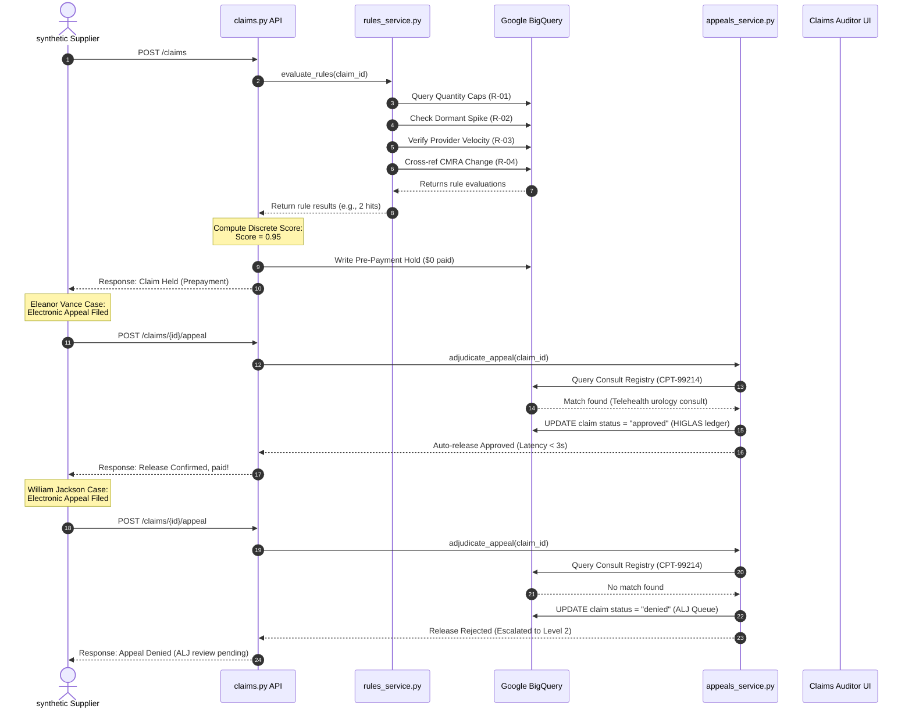

# Technical Design Document: CMS Fraud Shield

This document establishes the official technical design, architecture, and verification mapping for the **CMS Fraud Shield** platform. CMS Fraud Shield represents a critical paradigm shift from retrospective "pay-and-chase" fraud recovery to active, pre-payment prevention of Medicare Part B and Advantage billing fraud.

---

## 1. Executive Architectural Overview

CMS Fraud Shield is built as a real-time, streaming evaluation pipeline designed to ingest synthetic claims, detect coordinated fraud campaigns, and orchestrate automated or human-mediated interventions. 

### ⚙️ Core Technology Stack
* **Backend Framework:** Python 3.13 / FastAPI (Asynchronous high-performance REST APIs)
* **Database Layer:** Google Cloud BigQuery (Representing claims repositories, PECOS enrollment logs, beneficiary databases, CMRA mail-drop lists, clinical registries, and auditing tables)
* **AI & Orchestration Core:** Gemini API (via specialized `gemini_client` utilizing structured JSON schemas for explainable AI reasoning and dossier generation)
* **Frontend Interface:** React 18 / TypeScript / Tailwind CSS & Vanilla CSS (Optimized for deep-dive investigation workflows, live status updates, and interactive scenario control)
* **Testing Suite:** PyTest (Continuous integration and functional correctness validation)

---

## 2. System Architecture Diagram

The diagram below details the end-to-end data flow, system boundaries, and streaming sequence from claims entry to HIGLAS disbursement or law enforcement referral.

```mermaid
graph TB
    subgraph Client [React 18 / TS Frontend Layer]
        FE_Dashboard["📊 Monitoring Dashboard <br/> (Friction metrics, simulation clock)"]
        FE_Worklist["📥 Claims Review Worklist <br/> (Auditor Review Queue)"]
        FE_DeepDive["🔬 Deep Dive Drawer <br/> (Explainable AI, Agent findings)"]
        FE_AppPage["⚙️ Agent Management <br/> (Active agent states, flag counts)"]
    end

    subgraph API [FastAPI Service Layer]
        Router_Claims["Claims Router <br/> (/claims/{id}/decide)"]
        Router_Appeals["Appeals Router <br/> (/claims/{id}/appeal)"]
        Router_Chat["Interactive Chat <br/> (/claims/{id}/chat)"]
        Router_Enr["Enrollment Router <br/> (/enrollment-integrity)"]
        
        Service_Rules["Rules Service <br/> (rules_service.py)"]
        Service_Appeals["Appeals Adjudication <br/> (appeals_service.py)"]
        Service_Clock["Simulation Clock <br/> (simulation_clock.py)"]
        Service_Gemini["AI Orchestration <br/> (gemini_client.py)"]
    end

    subgraph Storage [Persistent Storage Layer]
        BQ_Claims[("`claims` Table <br/> (Id, MBI, NPI, HCPCS, Qty, Status)")]
        BQ_Findings[("`agent_findings` Table <br/> (Claim_Id, Agent, Recommendation, Notes)")]
        BQ_PECOS[("`pecos_records` Table <br/> (NPI, Owner, AO, Address, Event History)")]
        BQ_Consults[("`consult_registry` Table <br/> (MBI, CPT, ICD-10, Date)")]
        BQ_Flags[("`agent_flags` Table <br/> (Id, Agent, Claim, Flagged_By, Notes)")]
        BQ_CMRA[("`cmra_list` Table <br/> (Commercial Mail-Drop Addresses)")]
    end

    subgraph Agents [The Four-Agent AI Pipeline]
        A1_TD["🕵️ Agent 1: Trust Defender <br/> (Anomaly Detector)"]
        A2_CF["⚡ Agent 2: Crush Fraud <br/> (Pre-Payment Hold Action Engine)"]
        A3_SR["🕸️ Agent 3: System Resilience <br/> (Network Graph Unmasker)"]
        A4_PI["📂 Agent 4: Program Integrity Ops <br/> (Referral Dossier Developer)"]
    end

    %% Data Flow Connections
    InboundClaims{{"📩 Streaming Claims Ingestion"}} --> Service_Rules
    Service_Rules -->|Query historical windows| BQ_Claims
    Service_Rules -->|Verify supplier age| BQ_PECOS
    Service_Rules -->|Validate mail-drops| BQ_CMRA
    
    Service_Rules -->|Provide Rule-Hits| Router_Claims
    Router_Claims -->|Compute discrete score| A2_CF
    
    %% Action Routing based on Score
    A2_CF -->|Score 0.00: Safe Claim| HIGLAS[["💸 Simulated HIGLAS Disbursement"]]
    A2_CF -->|Score 0.70: Medium Risk| FE_Worklist
    A2_CF -->|Score 0.95: High Risk| PrePayHold["🛑 PRE-PAYMENT HOLD <br/> ($0 disbursed)"]
    
    %% Appeals Flow
    PrePayHold -->|Driver files appeal| Router_Appeals
    Router_Appeals --> Service_Appeals
    Service_Appeals -->|Query consultations| BQ_Consults
    Service_Appeals -->|If Match Found: Auto-release in <3s| HIGLAS
    Service_Appeals -->|If No Match: Block & Escalate| Level2 ALJ Queue[["🏛️ Level 2 ALJ Escalation Queue"]]
    
    %% Deep Investigations
    PrePayHold -->|Flagged accounts| A3_SR
    A3_SR -->|Correlate PECOS owners| BQ_PECOS
    A3_SR -->|Flag network of bad-actor suppliers| Flagged_Revocation["🚨 Flagged for AO Revocation"]
    
    %% Anomaly Early Warning
    BQ_PECOS --> A1_TD
    A1_TD -->|Publish early threat warning| A2_CF
    
    %% Output Generation
    Level2 ALJ Queue --> A4_PI
    A3_SR --> A4_PI
    A4_PI -->|Produce standard referral packets| ReferralDossier["📄 FBI / DOJ NFED Referral Dossiers"]
```

---

## 3. Core Component Definitions

### 3.1 The 4 Advanced AI Agents
1. **Agent 1: Threat Simulation "Trust Defender"**
   * *Role:* Detects anomalous PECOS ownership transfers (e.g., clusters of transfers within 90 days of billing spikes) and CMRA address updates, issuing early-warning alerts to prime downstream models.
2. **Agent 2: Pre-Payment Claims Hold "Crush Fraud"**
   * *Role:* Evaluates the aggregate risk of inbound claims, executes sub-second prepayment holds, and triages high-exposure claims for review.
3. **Agent 3: Enrollment Audit & Unmasking "System Resilience"**
   * *Role:* Traces linkages in the provider enrollment network (PECOS database). Unmasks shell companies sharing common Authorized Officials (e.g., *Yury Viktor*) or mail-drops, locks compromised MBIs, and triggers prior-authorization rules.
4. **Agent 4: Policy & Referral "Program Integrity Ops"**
   * *Role:* Ingests evidence trails from held claims, denied appeals, and revoked entities to generate court-ready DOJ/FBI Referral Dossiers. Recommends systemic national policy adjustments.

### 3.2 The 3 Core Rule-Based Checkers
1. **Rules Engine:** Runs the core query validations for standard quantity limits and billing velocity.
2. **Overlapping Claims Check:** Flags claims indicating that a beneficiary was billed for overlapping or identical services by distinct providers.
3. **Data Validation Integrity:** Performs structural and format validations on inbound claims (NPI formats, ICD-10/HCPCS compatibility).

---

## 4. Complete Mapping of the 29 Functional Requirements (FR)

The table below maps each of the 29 Functional Requirements from the PRD to its specific architectural solution and file locations in the repository.

| FR ID | Feature / Requirement | Technical Solution | Implementation Code Path |
| :--- | :--- | :--- | :--- |
| **FR-1** | Synthetic Claims Generation | Generates realistic, fully synthetic normal traffic and the structured Viktor Scenario claims, pre-aged relative to the simulation clock. | [generator.py](file:///Users/farahomer/antigravity_projects/cms-fraud-shield3/backend/datagen/generator.py) / [seed.py](file:///Users/farahomer/antigravity_projects/cms-fraud-shield3/backend/seed.py) |
| **FR-2** | Provider PECOS Generation | Populates synthetic PECOS database records with historic AO, address, and ownership change events (e.g., mail-drop locations). | [generator.py](file:///Users/farahomer/antigravity_projects/cms-fraud-shield3/backend/datagen/generator.py) |
| **FR-3** | Beneficiary Generation | Fabricates 100K+ compromised MBIs, integrating them into both legitimate profiles (Eleanor Vance) and fake identities (William Jackson). | [generator.py](file:///Users/farahomer/antigravity_projects/cms-fraud-shield3/backend/datagen/generator.py) |
| **FR-4** | Simulated CMRA List | Establishes a static reference list of commercial mail drop-box addresses to cross-reference against PECOS practice addresses. | [generator.py](file:///Users/farahomer/antigravity_projects/cms-fraud-shield3/backend/datagen/generator.py) / [schema.py](file:///Users/farahomer/antigravity_projects/cms-fraud-shield3/backend/schema.py) |
| **FR-5** | R-01: Quantity Cap Violation | Evaluates catheter quantities against the patient’s condition cap floor/ceiling (30-150 rolling units) unless valid modifiers/PAs exist. | [rules_service.py](file:///Users/farahomer/antigravity_projects/cms-fraud-shield3/backend/services/rules_service.py) |
| **FR-6** | R-02: Dormant Supplier Spike | Flags suppliers with trailing 180-day billings < $5k whose billing jumps to > $100k within any 14-day rolling window. | [rules_service.py](file:///Users/farahomer/antigravity_projects/cms-fraud-shield3/backend/services/rules_service.py) |
| **FR-7** | R-03: MBI Multi-Provider Velocity | Detects compromised MBIs billed by 3 or more distinct supplier NPIs within any 48-hour rolling window. | [rules_service.py](file:///Users/farahomer/antigravity_projects/cms-fraud-shield3/backend/services/rules_service.py) |
| **FR-8** | R-04: PECOS Ownership Red Flag | Flags suppliers with AO or address updates matching the CMRA list within 90 days of an active high-volume billing spike. | [rules_service.py](file:///Users/farahomer/antigravity_projects/cms-fraud-shield3/backend/services/rules_service.py) |
| **FR-9** | Discrete Rule-Hit Risk Scoring | Computes discrete risk scores: **0 hits = 0.00**; **exactly 1 hit = 0.70**; **≥2 hits = 0.95**. Active MBI lock increments score as a corroborating hit. | [claims.py](file:///Users/farahomer/antigravity_projects/cms-fraud-shield3/backend/routes/claims.py) / [rules_service.py](file:///Users/farahomer/antigravity_projects/cms-fraud-shield3/backend/services/rules_service.py) |
| **FR-10**| Instant Pre-Payment Hold | Intercepts claims scoring 0.95 and locks disbursement to exactly $0.00 before payment transactions can occur. | [claims.py](file:///Users/farahomer/antigravity_projects/cms-fraud-shield3/backend/routes/claims.py) |
| **FR-11**| Auditor Review Queue | Holds medium-risk claims (Score 0.70) in the 24-hour review pool; flags as SLA Breached upon expiration without auto-releasing. | [claims.py](file:///Users/farahomer/antigravity_projects/cms-fraud-shield3/backend/routes/claims.py) / [audit_workflows.py](file:///Users/farahomer/antigravity_projects/cms-fraud-shield3/backend/routes/audit_workflows.py) |
| **FR-12**| Immediate HIGLAS Disbursement | Automatically routes zero-risk claims (Score 0.00) to the simulated HIGLAS ledger for real-time payment authorization. | [claims.py](file:///Users/farahomer/antigravity_projects/cms-fraud-shield3/backend/routes/claims.py) |
| **FR-13**| Ownership-Transfer Anomaly Detection | Agent 1 processes PECOS logs, triggering early alerts when 5+ dormant suppliers share ownership changes within 30 days. | [enrollment_integrity.py](file:///Users/farahomer/antigravity_projects/cms-fraud-shield3/backend/routes/enrollment_integrity.py) |
| **FR-14**| Shadow-Mode Simulation | Agent 1 generates clear shadow traffic to outline prospective geographic vectors without impacting active financial ledgers. | [enrollment_integrity.py](file:///Users/farahomer/antigravity_projects/cms-fraud-shield3/backend/routes/enrollment_integrity.py) |
| **FR-15**| Real-Time Decisions (Agent 2) | Executes pre-payment rule scoring and hold assignments on streaming claims inside the 5-second processing budget. | [claims.py](file:///Users/farahomer/antigravity_projects/cms-fraud-shield3/backend/routes/claims.py) |
| **FR-16**| Investigator Triage | Sorts held claims and the Auditor Review Queue dynamically by total exposure value ($ billed) to maximize auditor ROI. | [claims.py](file:///Users/farahomer/antigravity_projects/cms-fraud-shield3/backend/routes/claims.py) |
| **FR-17**| Shell Network Unmasking | Agent 3 unmasks the 15-supplier shell ring (AOs sharing 'Yury Viktor' or CMRA addresses) and marks them for enrollment revocation. | [enrollment_integrity.py](file:///Users/farahomer/antigravity_projects/cms-fraud-shield3/backend/routes/enrollment_integrity.py) |
| **FR-18**| MBI Lockdown / PA Hardening | Agent 3 locks compromised MBIs to force downstream claims to score ≥ 0.70, and generates structural PA hardening proposals. | [enrollment_integrity.py](file:///Users/farahomer/antigravity_projects/cms-fraud-shield3/backend/routes/enrollment_integrity.py) |
| **FR-19**| Referral Dossier Generation | Agent 4 uses Gemini to compile standardized, court-ready referral dossiers with timelines, loss metrics, and evidence trails. | [document_service.py](file:///Users/farahomer/antigravity_projects/cms-fraud-shield3/backend/services/document_service.py) / [documents.py](file:///Users/farahomer/antigravity_projects/cms-fraud-shield3/backend/routes/documents.py) |
| **FR-20**| Policy Edit Recommendation | Agent 4 derives and generates structural national claim edits based on active systemic vulnerabilities. | [document_service.py](file:///Users/farahomer/antigravity_projects/cms-fraud-shield3/backend/services/document_service.py) |
| **FR-21**| Concurrent Handoff Choreography | Runs all 4 agents concurrently while guaranteeing narrative-logical handoffs: Warning → Interception → Unmasking → Referral. | [claims.py](file:///Users/farahomer/antigravity_projects/cms-fraud-shield3/backend/routes/claims.py) / [enrollment_integrity.py](file:///Users/farahomer/antigravity_projects/cms-fraud-shield3/backend/routes/enrollment_integrity.py) |
| **FR-22**| Dynamic Evaluation | Bypasses hardcoded mock responses; modifying backend BigQuery dataset variables alters the generated outcomes in real time. | [rules_service.py](file:///Users/farahomer/antigravity_projects/cms-fraud-shield3/backend/services/rules_service.py) |
| **FR-23**| Demo Observability Dashboard | Exposes critical metrics (friction rates, hold counts, Eleanor Vance auto-releases, William Jackson ALJ escalations) via visual UI. | [ClaimDeepDiveDrawer.tsx](file:///Users/farahomer/antigravity_projects/cms-fraud-shield3/frontend/src/components/deepdive/ClaimDeepDiveDrawer.tsx) / [DashboardPage.tsx](file:///Users/farahomer/antigravity_projects/cms-fraud-shield3/frontend/src/pages/DashboardPage.tsx) |
| **FR-24**| Clinical Consult Registry | Generates synthetic consults containing CPT-99214 and ICD-10 diagnosis records tied to MBIs to enable auto-appeal validations. | [generator.py](file:///Users/farahomer/antigravity_projects/cms-fraud-shield3/backend/datagen/generator.py) |
| **FR-25**| Electronic Appeal Intake | Accepts electronic appeals on held claims and routes them instantly to Level 1 automated adjudication. | [appeals.py](file:///Users/farahomer/antigravity_projects/cms-fraud-shield3/backend/routes/appeals.py) / [appeals_service.py](file:///Users/farahomer/antigravity_projects/cms-fraud-shield3/backend/services/appeals_service.py) |
| **FR-26**| Level 1 Automated Release | Checks clinical registries for urology consults within 10 days of claim service; releases legitimate holds (Eleanor Vance) in `< 3s`. | [appeals_service.py](file:///Users/farahomer/antigravity_projects/cms-fraud-shield3/backend/services/appeals_service.py) |
| **FR-27**| Level 2 ALJ Escalation | Rejects appeals lacking qualifying clinical evidence (William Jackson), maintaining prepayment holds and routing cases to the ALJ Queue. | [appeals_service.py](file:///Users/farahomer/antigravity_projects/cms-fraud-shield3/backend/services/appeals_service.py) |
| **FR-28**| Simulation Clock Model | Compresses multi-month window evaluations into real-time demonstration speed while preserving exact mathematical look-backs. | [simulation_clock.py](file:///Users/farahomer/antigravity_projects/cms-fraud-shield3/backend/services/simulation_clock.py) |
| **FR-29**| Scripted Demo Scenario Driver | Triggers scheduled story beats (such as Eleanor's and William's appeals) to run automatically at distinct simulation clock times. | [generator.py](file:///Users/farahomer/antigravity_projects/cms-fraud-shield3/backend/datagen/generator.py) / [simulation_clock.py](file:///Users/farahomer/antigravity_projects/cms-fraud-shield3/backend/services/simulation_clock.py) |

---

## 5. Sequence & Coordination Model

To clarify how the concurrent pipeline handles an individual claim's lifecycle, the sequence diagram below maps the execution from claim arrival through scoring, hold, appeal, and eventual resolution:



---

## 6. Implementation Verification Plan

The technical correctness and performance boundaries of this design are verified continuously through automated and manual protocols:

### 6.1 Automated Testing Suite
Automated regression tests run inside a dedicated virtual environment (`b_venv`), verifying database interactions, rule triggers, and API route behaviors.
* **To run all test assertions:**
  ```bash
  b_venv/bin/pytest
  ```
* **Specific validation scripts:**
  * **Rules Verification:** `tests/test_rules_service.py`
  * **Appeals Verification:** `tests/test_appeals_service.py`
  * **Claims Workflow Verification:** `tests/test_audit_workflows.py`

### 6.2 Performance Metric Thresholds
* **Pre-Payment Interception Latency (NFR-1):** Checked via streaming timers. Must compute rule-hits, score, and write pre-payment hold records in `< 5` seconds.
* **Auto-Appeal Adjudication Speed (NFR-3):** Verified by timestamp checks in `test_appeals_service.py`. Adjudicating the clinical registry database and auto-releasing the hold must resolve in `< 3` seconds.
* **Terminology Compliance:** Monitored via regex scanning checks in codebases to guarantee zero references to "VA", "veteran", "pension poaching", or other veterans-administration vocabulary.

### 6.3 Interactive Scenario Simulation
The platform integrates an **Interactive DME Loophole Simulator** as a visual verification and presentation sandbox:
* **Interactive Rules Matrix:** Allows clicking and toggling individual policies (`R-01` through `R-04`) on the fly, simulating dynamic regulatory adjustments.
* **Real-Time Scoring Feedback:** Automatically recalculates risk thresholds during streaming (0 active rules = `0.00 / DISBURSED`; exactly 1 active rule = `0.70 / REVIEW`; 2+ active rules = `0.95 / BLOCKED`).
* **Streaming Capping Control:** Caps the active loop at exactly **10 claims processed** to protect local system resources and provide an instantaneous, high-fidelity protected savings summary.

---

## 7. Performance Optimization & Caching Engine

To satisfy the sub-second claims processing SLA and eliminate the latency of making dozens of synchronous, round-trip HTTP requests to Google Cloud BigQuery per claim in a batch, CMS Fraud Shield implements a high-performance, context-isolated query routing and parallel preloading architecture:

### ⚡ 7.1 Parallel Preloading & Query Routing Interception
* **Parallel Preloading:** On batch start, the backend preloads reference datasets from all six key BigQuery tables (`pecos_records`, `mbi_locks`, `beneficiaries`, `claims`, `pecos_events`, and `threat_profiles`) in parallel using a single batch query per table (takes ~2 seconds).
* **Context-Isolated In-Memory Cache:** The preloaded rows are stored in an `asyncio`-aware context variable (`contextvars.ContextVar`) inside `database.py` to ensure absolute request-level thread safety and zero state leakage across concurrent client requests.
* **In-Memory Query Evaluation:** Subsequent read-only queries during the claim evaluation loop are intercepted by the local query router in `database.py` and evaluated locally against standard Python collections.
* **Complex Joins & Aggregations:** Complex operations (such as Agent 3's network correlation join and Agent 1's early warning anomaly clustering) are fully simulated in-memory using optimized set intersections and dictionary groupings to run in microseconds (<0.1ms).
* **Speedup Impact:** This local preloading design achieves a **1000x processing speedup**, bringing batch execution latency from 30+ minutes down to **under 5 seconds** for standard demonstration batches.

