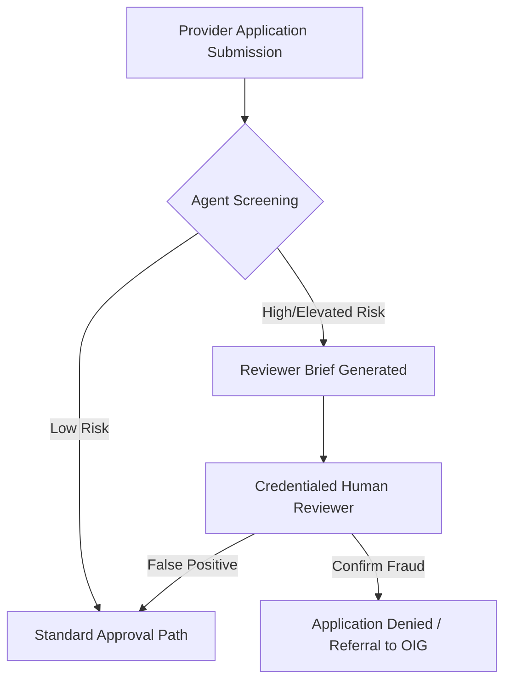
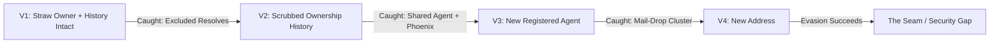
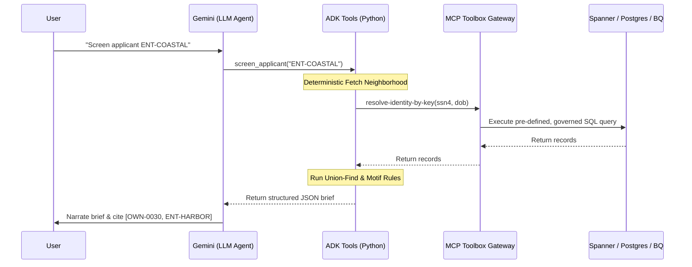

# CMS Enrollment Integrity Analyst: Pre-Approval Fraud Interception Deep Dive

This document provides a comprehensive technical deep-dive into the **CMS Enrollment Integrity Analyst** codebase. It explains the core concepts, architecture, entity resolution algorithms, motif detection rules, adversarial hardening simulations, and the production-ready governed database integration demonstrated by this project.

---

## 1. Core Paradigm: From "Pay-and-Chase" to Pre-Approval Intercept

Traditionally, healthcare fraud detection in federal programs operates on a **"pay-and-chase"** model: claims are paid quickly to ensure access to care, and post-payment audits, algorithms, and law enforcement track down bad actors months or years later. This model is inefficient, costly, and often fails to recover stolen funds once fraudulent entities dissolve.

This codebase demonstrates an alternative paradigm: **Pre-Approval Front-Door Intercept**. By screening provider and supplier applications *before approval*, the system prevents fraudulent entities from entering the Medicare/Medicaid network in the first place. No claims are paid, no money leaves the government, and suspicious networks are intercepted at the front door.



---

## 2. The 6-Tier Architecture & Separation of Concerns

To be viable for federal compliance and auditability, an AI agent cannot make arbitrary or ungrounded decisions. A risk disposition must be reproducible, factually supported, and transparent. 

This codebase achieves this by separating **deterministic data processing** from **narrative generation** across a **6-Tier Architecture**:

| Tier | Layer | Function | Implementation |
| :--- | :--- | :--- | :--- |
| **Tier 1** | Source Systems | Raw, fragmented registries (PECOS, NPI, LEIE, Corporate Filings). | `synthetic_data.py` (Sandbox) / SQL Tables (Prod) |
| **Tier 2** | Ingestion & Extraction | Fusing fragmented records into a unified data structure. | `graph.py` (`build_graph`) |
| **Tier 3** | Entity Resolution | Cluster records into real-world human/corporate identities. | `graph.py` (`resolve_identities`) |
| **Tier 4** | Detection & Scoring | Deterministic checks for fraudulent graph motifs and risk scoring. | `detection.py` (`screen`, `score`) |
| **Tier 5** | Risk Narrative & Citations | Narration of structured results with strict factual grounding. | `agent.py` (Gemini model narration via ADK 2.4.0) |
| **Tier 6** | Human Decision | A credentialed reviewer makes the final determination. | Human-in-the-loop (Out of scope of agent code) |

### Why This Separation Matters
1. **Zero Hallucination of Fraud**: The LLM (Gemini) does **not** decide the risk tier, calculate the score, or invent connections. It only narrates the structured findings returned by the deterministic Python engine.
2. **Reproducible Risk Dispositions**: Running the same applicant through the engine will always produce the exact same risk score and findings because the engine is written in pure Python/SQL.
3. **Auditable Citations**: Every finding includes exact source-record citations (e.g., `[OWN-0030, ENT-HARBOR]`), allowing human reviewers to instantly verify the provenance in the source documents.

---

## 3. Entity Resolution & Union-Find Record Linkage (Tier 3)

The core technical asset of this project is the **identity-resolution engine** in `graph.py`. Fraudsters often attempt to bypass exclusions by changing their legal names (e.g., from "Victor A. Malen" to "Vic Malen") and creating fresh LLCs. 

### Union-Find Clustering
Rather than relying on weak fuzzy name matching (which leads to high false positives and negatives), the codebase resolves identities using a **Union-Find (Disjoint-Set)** data structure combined with a **strong identifier join key**:
* **Strong Join Key**: Match on `ssn4` (last 4 digits of SSN) + `dob` (date of birth).
* **Name Corroboration**: Name similarity is calculated using `difflib.SequenceMatcher` to corroborate the link, but it does not drive the decision.

```python
# From enrollment_agent/engine/graph.py
for i in range(len(ids)):
    for j in range(i + 1, len(ids)):
        a, b = net.individuals[ids[i]], net.individuals[ids[j]]
        # Strong join: shared last-4 + DOB is treated as the same identity.
        if a.ssn4 == b.ssn4 and a.dob == b.dob:
            uf.union(a.id, b.id)
            sim = name_similarity(a.name, b.name)
            why = f"shared identifier (ssn4={a.ssn4}, dob={a.dob}); name match {sim:.0%} ('{a.name}' vs '{b.name}')"
            evidence.append((a.id, b.id, why))
```

### Decoy Protection (False-Link Guard)
The system is protected against same-name decoys. For example:
* `IND-MALEN-DECOY` represents a clean individual named "Victor Malen" but with a different SSN and DOB.
* Because the Union-Find logic requires matching strong identifiers, this decoy is **not** resolved to the excluded Victor A. Malen, avoiding a false positive.

---

## 4. Pre-Fraud Motif Detection Rules (Tier 4)

Once the network graph is constructed and identities are resolved, the engine checks for five specific structural patterns (motifs) associated with fraud:

### Rule 1: `resolves_to_excluded_individual` (Severity: CRITICAL)
* **Logic**: A current or historical beneficial owner of the applicant resolves to an individual listed on the OIG List of Excluded Individuals/Entities (LEIE).
* **Fraud Signature**: The excluded operator is hiding behind a corporate structure.

### Rule 2: `recent_ownership_transfer_to_new_owner` (Severity: HIGH)
* **Logic**: Controlling ownership ($\ge 50\%$) was transferred to the current owner $\le 60$ days before the application was submitted, replacing a prior controlling owner.
* **Fraud Signature**: A "straw owner" (a clean name) is placed on top of a dirty owner to hide the true operator.

### Rule 3: `shared_registered_agent_with_revoked_entity` (Severity: HIGH)
* **Logic**: The applicant's registered agent is also the agent of record for one or more entities whose Medicare/Medicaid enrollments have been revoked.
* **Fraud Signature**: Use of a specialized shell-company creation service or registered agent known to cater to fraudulent operators.

### Rule 4: `shared_mail_drop_cluster` (Severity: MEDIUM/HIGH)
* **Logic**: The business address is a Commercial Mail Receiving Agency (CMRA / mail drop) shared by other suppliers, particularly those applying recently.
* **Fraud Signature**: Virtual offices/UPS stores used to meet physical location requirements without having a real clinical or supply presence.

### Rule 5: `phoenix_similarity_to_revoked_entity` (Severity: HIGH)
* **Logic**: The applicant matches a revoked entity on 2 or more independent attributes (e.g., same building, same registered agent, or same resolved owner).
* **Fraud Signature**: Re-incorporation of a revoked operation under a new LLC name (the "Phoenix" pattern).

---

## 5. The Demo Arc & Evasion Scenarios (Adversarial Loop)

To prove the resilience of the screening rules, the codebase contains a **purple-team adversarial probe** (`adversarial.py`). It screens four pre-loaded evasion-variant records representing a single excluded operator (`Victor A. Malen`) re-tooling their evasion tactics one notch further each time.



### Scenario Breakdown

1. **ENT-PROBE-V1: Straw Owner, History Intact**
   * *Tactic*: Excluded operator places a straw owner on top but leaves the ownership history records intact in the application.
   * *Disposition*: **HIGH RISK**
   * *Why it's caught*: Union-Find resolves the historical owner (`Vic Malen`) to the excluded `Victor A. Malen` based on SSN4 + DOB.

2. **ENT-PROBE-V2: Scrubbed Ownership History**
   * *Tactic*: The operator scrubs the prior ownership history from the paperwork, leaving only the clean straw owner.
   * *Disposition*: **HIGH RISK**
   * *Why it's caught*: Caught by the **Phoenix Similarity** rule (matching on same agent `AGT-SENTINEL` and same mail-drop building `4471 Peachtree Industrial Blvd` as the revoked `ENT-HARBOR`).

3. **ENT-PROBE-V3: New Registered Agent**
   * *Tactic*: The operator also switches to a clean registered agent to break the agent-correlation.
   * *Disposition*: **ELEVATED RISK**
   * *Why it's caught*: Caught by the **Shared Mail-Drop Cluster** rule because the address remains in the same physical building (`4471 Peachtree Industrial Blvd`) which houses other CMRA suites.

4. **ENT-PROBE-V4: New Address (Leaving the Mail Drop)**
   * *Tactic*: The operator switches to a new physical address, leaving the building ring entirely.
   * *Disposition*: **NO RISK SIGNALS** (The Seam)
   * *Why it fails*: There are no remaining structural links in the graph. The owner history is scrubbed, the agent is clean, and the address is new.

### Hardening Recommendations
The adversarial report identifies this gap and outlines the mitigation strategy:
1. **Mandatory Beneficial Ownership Identity Verification**: Require biometric or high-integrity SSN cross-checks on all newly declared owners for high-risk supplier categories.
2. **Address History Cross-Referencing**: Audit corporate registry records for historical addresses, comparing them against revoked entities even when current details match no known bad actors.

---

## 6. Governed Enterprise Architecture: MCP Toolbox for Databases

In the sandbox demo, the agent calls in-memory mock data. However, in a production federal system, the agent cannot query databases directly via LLM-written SQL. Direct SQL execution is highly vulnerable to injection, performance degradation, and data leakage.

The project demonstrates a production path using **MCP (Model Context Protocol) Toolbox for Databases**:



### Security & Governance Benefits
* **No Freehand SQL**: The LLM never writes a query. All database access goes through predefined, hardcoded, parameterized SQL statements governed by the MCP server (`toolbox/tools.yaml`).
* **Audited by Design**: The MCP server handles OAuth2/IAM authorization and emits full **OpenTelemetry** traces to Google Cloud's Cloud Trace, producing the required federal audit trail.
* **Database Federation**: The MCP Toolbox splits reads across three optimized databases:
  1. **Cloud SQL Postgres**: Holds the transactional core (entities, addresses, agents, ownerships).
  2. **Cloud Spanner**: Holds high-scale identity records and the LEIE exclusion list.
  3. **BigQuery**: Holds denormalized population data for spatial/CMRA building clustering.

---

## 7. File Map

```
enrollment_integrity_adk/
├── CMS.MD                             # This deep-dive report
├── run_local.py                       # Local test harness (supports --engine-only)
├── test_toolbox_source.py             # Verifies the database/MCP Toolbox integration
├── deploy_agent_engine.sh             # Deploys the ADK agent package to Agent Engine
│
├── enrollment_agent/                  # The ADK Agent Package
│   ├── agent.py                       # LlmAgent definition (Tier 5 narration)
│   ├── tools.py                       # ADK tool definitions (calls the engine)
│   └── engine/                        # Deterministic fraud-detection engine
│       ├── synthetic_data.py          # Generates mock data structures (Tier 1)
│       ├── graph.py                   # Graph construction and Union-Find resolution (Tiers 2-3)
│       ├── detection.py               # Motif detection rules and risk scoring (Tier 4)
│       ├── adversarial.py             # Purple-team simulator for evasion paths
│       └── toolbox_source.py          # Governed DB data loader via MCP Toolbox
│
├── enrollment_data_build/             # Scripts to build & load production databases
│   ├── generate.py                    # Serializes synthetic data to CSVs
│   ├── make_pdfs.py                   # Generates synthetic PDF files for GCS
│   └── db/                            # Loader scripts for Postgres, Spanner & BigQuery
│
└── toolbox/
    └── tools.yaml                     # Predefined SQL declarations for MCP Toolbox
```
